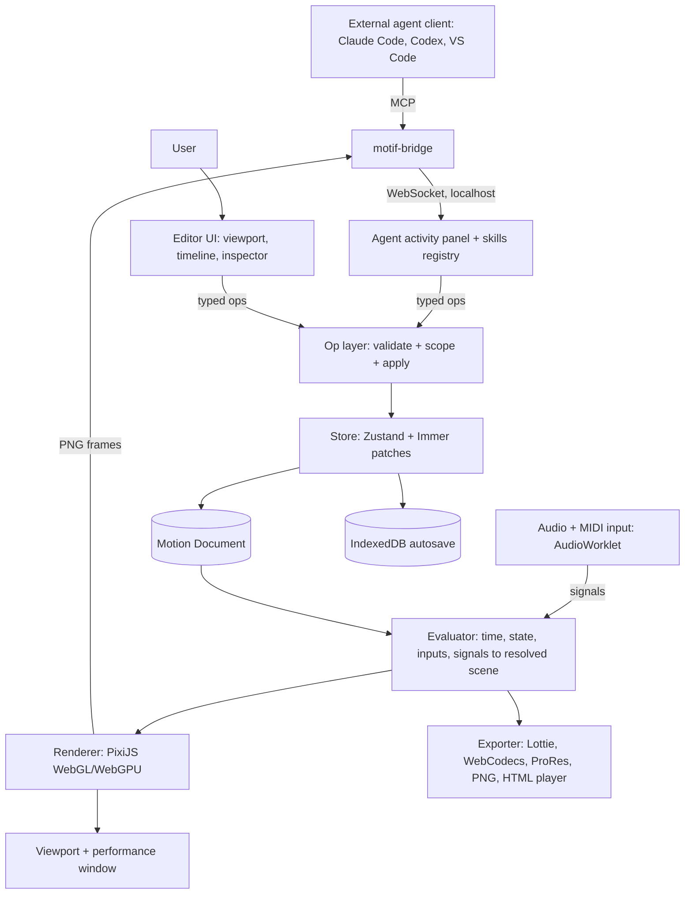
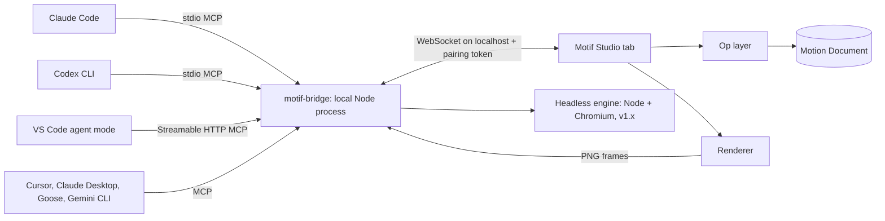
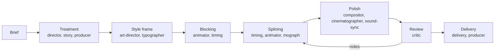

# Motif — PRD & Engineering Spec

Sep 26, 2026 · @Echo

Motif is a browser-based procedural animation studio where you describe motion in a prompt, the agent builds it as layered, code-driven animation, and you fine-tune it on a timeline.

## 1. Product overview

Motif makes one JSON Motion Document the single source of truth, so prompts, code, and the timeline all edit the same thing.

**Problem.** Motion tools force a choice. After Effects and Cavalry are powerful but manual and desktop-bound. GSAP and Motion Canvas are code-first with no visual editing. AI video tools output pixels you cannot edit. Nothing lets you prompt layered procedural motion and then hand-tune it frame by frame in a browser.

**Vision.** Describe it, watch it build, tune it, ship it. Every AI change is a reversible diff to a document, never an opaque render.

**Design principles**

1. **Document first.** The Motion Document is the product; the UI and the agent are editors of it.
2. **Procedural over keyframed.** Modifiers generate motion; keyframes shape it.
3. **Deterministic.** Same document, same seed, same frame, every time, on every machine.
4. **Simple surface, deep core.** Five layer types and about ten modifiers cover most work; expressions cover the rest.
5. **AI proposes, you decide.** Every agent pass is previewable, diffable, and revertible.

**Goals and success metrics (v1)**

| Goal | Metric | Target |
| --- | --- | --- |
| Prompt to motion fast | Time from prompt to first playable result | < 20 s |
| Prompt quality | Results accepted or kept after ≤ 2 refinement passes | ≥ 70% |
| Smooth editing | Preview frame rate, 50 layers, 500 glyphs, 1080p | 60 fps |
| Tunable output | AI-built scenes fully editable on timeline | 100% |
| Portable | Standalone HTML player bundle size (gzipped, without fonts) | < 80 KB |
| Deterministic | Frame hash matches across Chrome, Safari, Firefox | 100% of golden tests |

## 2. Users and use cases

The primary user is a creative technologist or motion designer who thinks in systems, works with AI agents, and wants code-grade output without writing the code.

| Persona | Job to be done | Key need |
| --- | --- | --- |
| Creative technologist (primary) | Generate kinetic type and generative graphics for apps, sites, and releases | Prompt to a layered, tunable scene; export to web |
| Motion designer | Rough out ideas fast, then polish by hand | Real timeline, curve editor, precise easing |
| Product / UI designer | Micro-interactions, loaders, onboarding motion | Interactive states, tiny web player, Lottie for iOS, Android, and web |
| Music / visual artist | Title cards, lyric-free type loops, audio-reactive visuals | Loops, seeds, audio and parameter bindings |

**Core use cases**

1. **Kinetic type.** Prompt: *"ECHO OPERA drops in letter by letter, overshoots, then dissolves into noise."* Produces per-glyph layers with stagger, spring, and noise.
2. **Geometric loops.** Prompt: *"12 concentric rings rotating at offset speeds, seamless 4-second loop."* Produces a repeater and rotation driven by time with a loop constraint.
3. **Shape morph sequences.** Circle to square to logo path, with trim-path reveals.
4. **Interactive widgets.** A button whose type scatters on hover and reassembles on leave, built as a state machine.
5. **Non-linear scenes.** Clips (intro, idle, outro) wired as states with triggers; the idle state loops until an event fires.
6. **Iterative refinement.** "Slower." "More elastic on the second word." "Make it feel like a Swiss poster." Each prompt produces a scoped diff.

## 3. Scope

v1 ships the full loop — prompt, procedural engine, timeline, state machines, a MoGraph-grade pro toolkit, live audio-reactive performance, and Lottie, web, and video export — for 2D type and vector shapes.

| Area | v1 | v1.x | Later |
| --- | --- | --- | --- |
| Layers | Text, Shape, Path, Group, Null, Precomp, Camera (2.5D) | Image, SVG import | Video, 3D extrusion |
| Procedural | 11 core modifiers, Cloner and effectors, falloffs, secondary-motion behaviors, expressions, GPU particles, rigid and soft-body physics | Position-based fluids, graph view | Node graph view |
| Timeline | Tracks, keyframes, value and speed graphs, viewport motion paths, precomps with time remap, audio track with beat grid | Keyframe assistants (sequence, offset, flip) | Multi-comp nesting UI |
| Agent | Build, refine, scoped edit, visual critique | Style presets library | Reference image or video to motion |
| Interactivity | State machine, pointer, scroll, time, variables, Live audio mode, MIDI | Bridge: Ableton Link, OSC, Syphon and Spout | Physics |
| Export | Lottie JSON and dotLottie, HTML player, render queue, ProRes 4444, MP4/WebM, PNG sequence, JSON | GIF, Lottie state machines (dotLottie interactivity) | GSAP, CSS, SwiftUI, and Compose code-gen |
| Collaboration | Local projects, JSON file import and export | Review links, versions and branches, SVG/AI and Lottie import, After Effects export | Multiplayer editing |

**Non-goals for v1**

- Raster painting, photo compositing, or rotoscoping.
- Character rigging or bone systems.
- AI video or image generation. Output is always vector and procedural.
- A full node-graph editor. Modifier stacks cover v1; the graph is a later view over the same data.
- Real-time multiplayer.

## 4. Functional requirements

Requirements are numbered by area so milestones, issues, and tests can reference them. The BRG and SKL series are in sections 11 and 12, the PRO series in section 16, the LIVE series in section 17, the PTX series in section 18, and the BVX series in section 19. P0 means required for v1, P1 means v1 if time allows, and P2 means later.

| ID | Requirement | Pri |
| --- | --- | --- |
| DOC-01 | The project is one serializable Motion Document; the UI and agent mutate it only through typed operations | P0 |
| DOC-02 | Every operation produces an Immer patch; undo and redo are unlimited within a session | P0 |
| DOC-03 | Schema is versioned with migrations; a document from any older version opens | P0 |
| DOC-04 | Autosave to IndexedDB every 2 s and on blur; JSON import and export | P0 |
| DOC-05 | Named snapshots and a history panel showing agent passes as labeled checkpoints | P0 |
| LYR-01 | Layer types: Text, Shape (rect, ellipse, polygon, star, line), Path, Group, Null | P0 |
| LYR-02 | Text splits into lines, words, or glyphs; each unit is an addressable sub-layer with its own transform | P0 |
| LYR-03 | Text converts to outline paths (opentype.js) for morph, trim, and fill effects | P0 |
| LYR-04 | Properties: position, anchor, scale, rotation, skew, opacity, fill, stroke, stroke width, dash, blend mode | P0 |
| LYR-05 | Masks and mattes (alpha, luma, inverted) between layers | P1 |
| LYR-06 | Parenting: any layer can parent another; Null layers act as controllers | P0 |
| LYR-07 | Web fonts: Google Fonts picker and local font upload (OTF, TTF, WOFF2), variable-font axis animation | P0 |
| PRC-01 | Each layer has an ordered, non-destructive modifier stack; modifiers can be toggled, reordered, and keyframed | P0 |
| PRC-02 | Core modifiers: Stagger, Repeater, Noise, Spring, Oscillate, Follow Path, Morph, Trim Path, Scatter, Align/Distribute, Loop | P0 |
| PRC-03 | Expressions: sandboxed TypeScript-subset functions bound to any property, with `t`, `i`, `n`, `seed`, `input`, and `ref()` | P0 |
| PRC-04 | Seeded randomness only; each layer has a seed and a global seed exists | P0 |
| PRC-05 | Fields and falloffs (radial, linear, noise) that drive modifier strength per sub-unit | P0 |
| TML-01 | Timeline with layer tracks, expandable property tracks, keyframes, and a playhead | P0 |
| TML-02 | Graph editor with Bézier handles, preset easings, and a spring curve type | P0 |
| TML-03 | Snap to frames, keys, markers, and beats; ripple and slip editing of layer in and out points | P0 |
| TML-04 | Work area, loop region, markers, and clips (named time ranges used by states) | P0 |
| TML-05 | Procedural motion visible on the timeline as a ghost curve, with a one-click bake to keyframes | P1 |
| AGT-01 | Prompts arrive from a connected MCP client (section 11): build new, refine all, or refine the selection | P0 |
| AGT-02 | Agent edits only through the tool API (section 11); it never emits raw JS for the runtime | P0 |
| AGT-03 | Each pass shows a diff summary and can be accepted, rejected, or branched | P0 |
| AGT-04 | Visual critique loop: render sampled frames, send to the model, self-correct up to N passes | P0 |
| AGT-05 | Scoped edits: prompts about "the second word" or a selection only touch those nodes | P0 |
| AGT-06 | Generate 3 variations side by side and pick one | P1 |
| INT-01 | State machine editor: states map to clips; transitions have triggers, conditions, and blend durations | P0 |
| INT-02 | Inputs: pointer position, hover, press, scroll progress, time, boolean, number, and trigger variables | P0 |
| INT-03 | Bindings map any input to any property through a range and curve | P0 |
| INT-04 | Audio input bindings (FFT bands, amplitude) | P0 |
| EXP-01 | Standalone HTML player: one file or a script tag plus the document JSON | P0 |
| EXP-02 | WebM and MP4 via WebCodecs at up to 4K and 60 fps, faster than real time where supported | P0 |
| EXP-03 | PNG sequence (zipped) with alpha | P0 |
| EXP-04 | Lottie JSON (Bodymovin 5.x) and .lottie export, native shapes and text where possible, baked fallback otherwise, with a per-layer compatibility report | P0 |
| EXP-05 | Lottie-safe mode: a toggle that limits authoring to features with native Lottie equivalents, with a live linter badge on every layer and modifier | P0 |
| EXP-06 | Lottie parity check: exported files render in lottie-web and dotlottie-web in-app and are frame-diffed against the Motif render before download | P0 |
| EXP-07 | Agent can be told "Lottie target"; it then uses only Lottie-safe tools and reports what it had to bake | P0 |
| UIX-01 | Viewport pan and zoom, onion skinning, guides, safe areas, and bounding-box handles for direct manipulation | P0 |
| UIX-02 | Keyboard-first: every core action has a shortcut; a command palette (Cmd+K) reaches every command | P0 |
| UIX-03 | UI built on fieldSYS v3 tokens with light and dark themes | P0 |

## 5. UX and information architecture

The workspace is one screen with five regions. There is no chat box. You prompt from your own agent client, and the Agent activity panel above the timeline shows what the agents are doing, so directing and tuning happen in the same place.

| Region | Position | Contents |
| --- | --- | --- |
| Toolbar | Top | Project name, mode switch (Linear, State machine), playback, frame and time readout, export |
| Layers and Assets | Left, 260 px | Layer tree with parenting, modifier stack per layer, fonts, colors, and presets |
| Viewport | Center | Canvas stage, direct-manipulation handles, guides, onion skin, state preview |
| Inspector | Right, 300 px | Properties of the selection, modifier parameters, expression editor, bindings |
| Agent activity | Above timeline | Connected clients, pipeline stage chips, streaming tool calls, scope chip (All or Selection), pass cards with accept, reject, and branch, studio notes |
| Timeline | Bottom, resizable | Tracks, keyframes, graph editor toggle, markers, clips, and a state-machine canvas in State mode |

**Flow A — build from a prompt**

1. Prompt your connected client (Claude Code, Codex, or VS Code); the Director skill picks it up and the scope defaults to All on an empty project.
2. The agent streams tool calls; layers appear in the tree and viewport as they are created.
3. The critique pass runs; the pass card shows "Pass 2 of 3: tightened stagger, fixed overlap on 'OPERA'".
4. Accept to commit, reject to revert, or branch to keep both versions.

**Flow B — tune by hand**

1. Click a glyph in the viewport; the timeline scrolls to its track.
2. Drag keys, or open the graph editor and reshape the easing.
3. Adjust modifier parameters in the Inspector; changes preview live.

**Flow C — scoped refine**

1. Select layers or a time range.
2. The bridge scope switches to Selection automatically.
3. The agent's tools are restricted to the selected node IDs and time range.

**Flow D — interactive**

1. Switch to State mode; clips from the timeline appear as state nodes.
2. Draw transitions and set triggers such as hover, click, or a variable threshold.
3. Press Play Interactive to test with a real pointer in the viewport.

## 6. System architecture

Four layers sit on one store. The core engine is a pure, framework-free package shared by the editor, the exporter, and the standalone player, so a frame renders identically everywhere.



| Package | Responsibility | Depends on |
| --- | --- | --- |
| `@motif/schema` | Types, Zod validators, versions, migrations | none |
| `@motif/core` | Evaluator, modifiers, easing, expressions, state machine, seeded RNG | schema |
| `@motif/render` | Scene to PixiJS display tree, text shaping, path tessellation | core |
| `@motif/ops` | Typed operations, validation, inverse patches, selection scoping | schema |
| `@motif/agent` | MCP tool, resource, and prompt definitions; pass manager; scope and allowlist enforcement; skills registry | ops, render |
| `@motif/export` | Video, PNG, HTML player bundle, Lottie mapper | core, render |
| `@motif/player` | Minimal runtime (evaluator + renderer + input) | core, render |
| `apps/studio` | React editor shell | all |
| `apps/bridge` | motif-bridge CLI: MCP server (stdio and HTTP), WebSocket relay, pairing, install-skills | none |
| `@motif/sim` | WebGPU particle compute, Rapier rigid bodies, XPBD soft bodies, simulation cache | core |

**Key rule.** Only `@motif/ops` writes to the document. The UI, the agent, and imports all go through it, which is what makes undo, diffs, and scoped agent edits uniform.

## 7. Motion Document schema

The document is a flat, ID-keyed graph rather than a nested tree, so ops, diffs, and agent references stay stable when layers move.

```typescript
type ID = string;            // nanoid, 10 chars
type Seconds = number;

interface MotionDocument {
  schema: 'motif/1';
  meta: { name: string; created: string; modified: string };
  comp: Composition;
  layers: Record<ID, Layer>;
  order: ID[];                         // root z-order, back to front
  clips: Record<ID, Clip>;             // named time ranges
  stateMachine?: StateMachine;
  variables: Record<ID, Variable>;
  assets: { fonts: Record<ID, FontAsset>; paths: Record<ID, PathData> };
  seed: number;
}

interface Composition {
  width: number; height: number;       // px
  fps: 24 | 25 | 30 | 50 | 60;
  duration: Seconds;
  background: Color | null;           // null = transparent
  loop: boolean;
}

type LayerKind = 'text' | 'shape' | 'path' | 'group' | 'null';

interface Layer {
  id: ID; name: string; kind: LayerKind;
  parent: ID | null; children?: ID[];  // group and null only
  inPoint: Seconds; outPoint: Seconds;
  visible: boolean; locked: boolean; seed: number;
  props: Record<PropKey, Property>;    // transform + kind-specific
  modifiers: Modifier[];               // ordered stack
  mask?: { source: ID; mode: 'alpha' | 'luma' | 'alphaInv' | 'lumaInv' };
  text?: TextSpec; shape?: ShapeSpec; path?: { asset: ID };
}

interface TextSpec {
  content: string; font: ID; size: number;
  axes?: Record<string, Property>;     // variable-font axes
  tracking: Property; leading: number;
  align: 'left' | 'center' | 'right';
  split: 'none' | 'lines' | 'words' | 'glyphs';
  asOutlines: boolean;
}

// Every animatable value is a Property.
interface Property<T = PropValue> {
  value: T;                            // static base value
  keys?: Keyframe<T>[];                // sorted by t
  expr?: { src: string; enabled: boolean };
  binding?: Binding;                   // input to value mapping
}

interface Keyframe<T> {
  id: ID; t: Seconds; v: T;
  ease: Ease;                          // ease into the NEXT key
}

type Ease =
  | { type: 'linear' | 'hold' }
  | { type: 'bezier'; x1: number; y1: number; x2: number; y2: number }
  | { type: 'spring'; stiffness: number; damping: number; mass: number }
  | { type: 'preset'; name: EasePreset };  // expoOut, backInOut, etc.

interface Modifier {
  id: ID; type: ModifierType; enabled: boolean;
  target: 'layer' | 'units';           // units = split glyphs, words, or repeater copies
  params: Record<string, Property>;    // every param is animatable
}

interface Clip { id: ID; name: string; start: Seconds; end: Seconds; loop: boolean }

interface StateMachine {
  entry: ID;
  states: Record<ID, { id: ID; clip: ID; speed: number }>;
  transitions: Transition[];
}

interface Transition {
  id: ID; from: ID | '*'; to: ID;
  trigger: { kind: 'event'; name: 'hover' | 'leave' | 'press' | 'release' | 'end' | string }
         | { kind: 'condition'; expr: string };
  blend: Seconds; ease: Ease;
}

interface Binding {
  input: 'pointer.x' | 'pointer.y' | 'scroll' | 'time' | `var.${ID}` | `audio.${string}`;
  inRange: [number, number]; outRange: [number, number];
  ease: Ease; smoothing: number;       // 0..1
}
```

**Rules**

- Colors are stored as OKLCH and interpolate in OKLCH, so fades never go muddy.
- All times are in seconds (floats); frame snapping happens in the UI only.
- Unknown modifier types survive round-trips untouched, for forward compatibility.
- The document is validated with Zod on load, on import, and on every agent op.

## 8. Render engine and evaluation model

Rendering is a pure function: `evaluate(doc, t, state, inputs) → ResolvedScene`, then `draw(ResolvedScene)`. Nothing in the evaluator reads the clock, `Math.random`, or the DOM.

**Evaluation pipeline per frame**

1. **Resolve time.** In Linear mode, `t` is the playhead. In State mode, the state machine maps wall-clock and events to one or two `(clip, localT, weight)` pairs for blending.
2. **Resolve inputs.** Pointer, scroll, and variables are smoothed and frozen into an `inputs` snapshot for this frame.
3. **Base properties.** For each property: binding, else expression, else keyframes, else static value.
4. **Expand units.** Text splits into glyph, word, or line units; Repeater expands copies. Each unit receives `i`, `n`, and a derived seed.
5. **Modifier stack.** Modifiers run in order, each reading and writing unit transforms and styles.
6. **Parenting.** World matrices are composed from the parent chain in topological order.
7. **Emit.** The result is a flat list of draw items (geometry, style, matrix, blend, mask).

**Renderer**

- PixiJS v8 with the WebGPU backend when available and WebGL2 as fallback.
- Text: glyph outlines come from opentype.js and are cached as tessellated `GraphicsContext` per font, glyph, and size bucket. MSDF text is used for runs over 2,000 glyphs.
- Shapes and paths are tessellated once and cached; only transforms and styles change per frame.
- Morph: flubber interpolators are precomputed per key pair and cached by key IDs.
- Masks use Pixi masks; blend modes map to Pixi blend modes.
- The draw list is diffed against the previous frame, so unchanged items are not touched.

**Determinism**

- Seeded RNG: `mulberry32(hash(docSeed, layerSeed, unitIndex, channel))`.
- Noise: simplex-noise seeded from the same hash.
- Springs are solved analytically (closed form for damped harmonic motion), never simulated step by step, so any frame can be evaluated out of order for scrubbing and export.
- Expressions run with a frozen global scope and no access to time other than `t`.

**Threading**

- Main thread: UI and PixiJS drawing.
- A worker evaluates frames ahead for export and for the critique sampler, using an OffscreenCanvas renderer.

## 9. Procedural modifier system

Eleven modifiers cover v1. Each is a pure function `(units, params, ctx) → units`, and every parameter is itself an animatable Property. The Lottie column shows how each one exports.

| Modifier | What it does | Key params | Lottie export |
| --- | --- | --- | --- |
| Stagger | Offsets each unit's local time | delay per unit, order (index, reverse, center-out, random, distance from point), ease | Native: per-unit keyframe offsets |
| Repeater | Makes N copies with incremental transform | count, offset transform, start and end opacity, radial or grid mode | Native: Lottie repeater (linear); grid baked to copies |
| Noise | Adds seeded simplex noise to any channel | channel, amplitude, frequency, octaves, seed, loop period | Baked to keyframes |
| Spring | Physically chases a target value | stiffness, damping, mass, target property | Baked to keyframes |
| Oscillate | Sine, triangle, or square motion | channel, amplitude, period, phase per unit | Baked to keyframes |
| Follow Path | Moves units along a path | path layer, progress, orient, spacing | Native for layers; per-glyph baked |
| Morph | Interpolates between shapes or glyph outlines | target shapes, progress, vertex matching | Native shape keyframes after vertex matching |
| Trim Path | Reveals stroke length | start, end, offset, per-unit or combined | Native: trim paths |
| Scatter | Randomizes unit transforms from a seed | position, rotation, and scale ranges; amount | Baked to static offsets plus keyframes |
| Align/Distribute | Lays units on grid, circle, or arc | layout, radius, spacing, amount | Baked |
| Loop | Forces seamless loops | mode (cycle, ping-pong, offset), period | Native loop via comp duration; baked for offset |

**Expressions**

- A TypeScript subset compiled with Sucrase and run in a restricted scope: `Math`, easing helpers, `noise(x, y?, z?)`, `random(i)`, `lerp`, `clamp`, `ref(layerId, prop)`.
- Context variables: `t` (seconds), `i` (unit index), `n` (unit count), `seed`, `value` (value before the expression), `input.*`.
- Guardrails: 5 ms budget per frame per expression, no loops over 10,000 iterations, no DOM or network.
- Example: `value + [0, Math.sin(t * 4 + i * 0.4) * 20]`.
- Lottie export: expressions are always baked to keyframes at comp fps, since Lottie expression support differs by runtime.

**Extensibility.** Modifiers register through `defineModifier({ type, params, apply, lottie? })`. The optional `lottie` hook returns a native Lottie mapping; without it the exporter bakes the modifier.

## 10. Timeline and curve editor

The timeline is a custom Canvas2D component, not DOM nodes, so it holds 500+ tracks and 20,000 keys at 60 fps.

**Structure**

- Row per layer, collapsible to property rows, then modifier-param rows.
- Split units (glyphs, words) show as a collapsible sub-group with a stagger overlay so you can see the offset fan.
- Ruler with seconds and frames, a work area, loop region, markers, and clips shown as named bars.
- Ghost curves draw procedural motion (noise, spring, oscillate, expressions) as a faint line on the property row.

**Keyframe editing**

- Click to add, drag to move, Shift for multi-select, Alt-drag to duplicate, box select.
- Alt-drag the edge of a selection to scale time around the opposite edge.
- Copy and paste keys across properties of the same type.
- Snap to frames, other keys, markers, clips, and a BPM grid.
- Right-click for ease presets; F9 applies the last-used ease.

**Graph editor**

- Value and speed graph views per property; separated dimensions for x and y.
- Bézier handles with numeric entry, a preset library (expo, back, circ, elastic), and a Spring ease type with a live preview dot.
- Normalize view to fit selected curves.

**Bake and unbake**

- Bake converts any procedural channel to keyframes at a chosen sample rate, then optionally reduces keys with Ramer–Douglas–Peucker simplification to a set tolerance.
- The original modifier is disabled, not deleted, so unbake restores it.
- The same bake routine powers Lottie export.

**Playback**

- Space plays and pauses, J/K/L shuttle, comma and period step frames, Home and End jump.
- Scrubbing evaluates exactly the requested frame; preview drops frames rather than slowing down.

## 11. Agent bridge

Motif has no built-in chat. You direct it from the agent client you already use, such as Claude Code, Codex, or VS Code. A local bridge exposes Motif as an MCP server, and those clients drive the studio through it.

**Why.** Your client brings its own model, account, context, and project files. Motif stays a focused motion tool with no API keys, and any MCP client works on day one.

**Topology**



- **`motif-bridge`** is a small Node CLI (`npx motif-bridge`). It speaks MCP over stdio for terminal clients and Streamable HTTP on `localhost:7331/mcp` for editor clients.
- The Studio connects to the bridge over a localhost WebSocket. On first connect, the Studio shows a 6-digit pairing code that you confirm once per client.
- Tool calls are relayed to the open Studio tab, validated by `@motif/ops`, applied live, and answered with results and rendered frames.
- Headless mode (v1.x) runs the engine without a tab, for batch renders and CI.

**Setup, one line per client**

| Client | Setup |
| --- | --- |
| Claude Code | `claude mcp add motif -- npx motif-bridge` |
| Codex CLI | `[mcp_servers.motif]` in `~/.codex/config.toml` with `command = "npx"`, `args = ["motif-bridge"]` |
| VS Code (agent mode) | `.vscode/mcp.json`: `{ "servers": { "motif": { "type": "http", "url": "http://localhost:7331/mcp" } } }` |
| Cursor, Claude Desktop, Goose, Gemini CLI | Same stdio command or HTTP URL in each client's MCP config |

The Studio's **Connect** menu shows these snippets with a copy button and the live connection status of each client.

**MCP surface**

| Kind | Items |
| --- | --- |
| Tools: document | `get_summary`, `get_layer`, `set_comp`, `add_layer`, `update_layer`, `remove_layer`, `set_keys`, `set_expression`, `add_modifier`, `update_modifier`, `remove_modifier`, `add_cloner`, `add_effector`, `add_precomp`, `set_camera` |
| Tools: structure | `add_clip`, `add_state`, `add_transition`, `bind_input`, `add_signal`, `add_reactor`, `add_reaction`, `add_reactor_state`, `expose_control` |
| Tools: look and check | `render_frames` (returns images), `render_contact_sheet`, `get_motion_stats` (velocities, overlaps, empty frames, flash rate), `lint_lottie` |
| Tools: session | `begin_pass`, `end_pass` (summary and self-score), `get_selection`, `set_selection`, `seek`, `play`, `export` |
| Resources | `motif://doc`, `motif://selection`, `motif://playhead`, `motif://frame/{t}`, `motif://skills/{name}`, `motif://brief` |
| Prompts | One per studio agent, such as `/motif:director` and `/motif:timing` (section 12) |

Selection, playhead, and document changes are pushed as resource-update notifications, so the client always knows what you are looking at.

**Passes and approval.** Every run of tool calls sits inside a pass. The Studio's **Agent activity panel** replaces the old prompt bar. It shows the connected client, streaming tool calls, the pass card with its summary, and Accept, Reject, and Branch. Nothing is committed until you accept; auto-accept can be enabled per client.

**Scope.** Selecting layers or a time range in the Studio sets the scope. The bridge rejects writes outside it, so “make the second word more elastic” only touches that word.

**Security.** The bridge binds to 127.0.0.1 only, requires the pairing token on every WebSocket message, checks the `Origin` header, and never touches files outside the project folder. Expression code from agents runs in the same sandbox as user expressions.

**Requirements**

| ID | Requirement | Pri |
| --- | --- | --- |
| BRG-01 | `motif-bridge` MCP server over stdio and Streamable HTTP | P0 |
| BRG-02 | Studio to bridge WebSocket with pairing code, token, and origin checks | P0 |
| BRG-03 | Full tool, resource, and prompt surface listed above, schema-validated | P0 |
| BRG-04 | `render_frames` and `render_contact_sheet` return images to the client | P0 |
| BRG-05 | Passes with Accept, Reject, Branch in the Agent activity panel; per-client auto-accept | P0 |
| BRG-06 | Scope enforcement from Studio selection | P0 |
| BRG-07 | Connect menu with setup snippets and status for Claude Code, Codex, VS Code, Cursor, Claude Desktop | P0 |
| BRG-08 | Several clients connected at once, with per-client pass attribution | P1 |
| BRG-09 | Headless engine mode for batch renders and CI | P1 |

AGT-01 to AGT-06 in section 4 now describe behavior delivered through the bridge: the prompt comes from the client, and the Studio shows and approves the passes.

## 12. Studio agents

Motif ships a full animation studio team as 16 agent skills. Whatever client you connect, it gets a Director who runs the job and specialists for story, design, animation, compositing, sound, and delivery, each grounded in the craft of that discipline.

**Roster**

| Department | Agent (skill) | Owns | Writes to the document? |
| --- | --- | --- | --- |
| Direction | `director` | Brief, treatment, delegation, review gates, final call | Notes only |
| Direction | `producer` | Scope, deliverables, formats, aspect ratios, pass budget, shot list | Comp settings, render queue |
| Story and design | `story` | Beats, arc, reading order, emphasis, animatic timing | Clips, markers |
| Story and design | `art-director` | Composition, grid, color, hierarchy, style frames, design tokens | Layout, color, styles |
| Story and design | `typographer` | Typeface, variable axes, splitting, legibility, reading time | Text layers, axes |
| Animation | `animator` | The 12 principles: poses, arcs, anticipation, overlap, appeal | Keys, eases, behaviors |
| Animation | `timing` | Speed, rhythm, spacing, easing curves, frame counts, holds | Keys, eases, time remap |
| Animation | `mograph` | Cloners, effectors, falloffs, procedural systems, expressions | Modifiers, cloners, expressions |
| Animation | `rigger` | Controllers, linked properties, templates, responsive layouts | Controls, links, constraints |
| Finishing | `cinematographer` | Camera, staging, depth, parallax, framing, shot flow | Camera, `z`, precomps |
| Finishing | `compositor` | Blending, depth cues, effects stack, motion blur, the final look | Effects, blend modes, mattes |
| Sound and interaction | `sound-sync` | Beat maps, hit points, audio bindings, live reactors | Audio track, signals, reactors |
| Sound and interaction | `interaction` | States, triggers, feedback, UI motion conventions | State machine, bindings |
| Quality and delivery | `critic` | Reviews against principles, legibility, loops, flashes, Lottie safety | Notes only (read-only) |
| Quality and delivery | `delivery` | Export specs, Lottie compatibility, file size, player setup | Export settings |
| Finishing | `fx` | Particles, forces, collisions, rigid and soft bodies, simulation caching and look | Particle systems, physics bodies, sim cache |

**Pipeline.** The Director runs work through the stages an animation studio uses. Each stage ends at a gate you can approve in the Agent activity panel, or set to auto-advance.



- **Blocking** uses stepped keys on key poses only, so you judge timing and staging before any easing.
- **Splining** converts to curves and adds spacing, arcs, and procedural systems.
- **Polish** adds secondary motion, camera, compositing, and sync.
- **Review** loops back with timestamped notes until the Critic's rubric passes or you sign off.

**Shared contract for every skill**

- **Role and scope:** what it owns, what it must hand off.
- **Craft rules:** the discipline's principles as concrete, checkable rules, such as “a hold of 6 frames or more before a major move”.
- **Tools allowed:** a tool allowlist. The Critic and Director are read-only apart from notes.
- **Procedure:** the steps it follows with Motif tools, including `render_frames` checks.
- **Rubric:** 1–5 scores it reports in `end_pass`.
- **Handoff:** what it writes to the notes and which agent goes next.

**Studio notes.** Agents and people leave notes pinned to a time range and layers, like dailies notes. Notes show as flags on the timeline and in the Agent activity panel, and they are the handoff medium between agents. Agents write them with the add\_note MCP tool. The schema gains `notes: Note[]` and `brief: Brief`.

**Distribution**

- Skills are the Agent Skills format (a folder with `SKILL.md`), served by the bridge as `motif://skills/{name}` resources and as MCP prompts, so any client can use them.
- `npx motif-bridge install-skills` also writes client-native copies: skills and subagent definitions for Claude Code, skills for Codex, and prompt files for VS Code.
- A house-style file (`motif://brief/house-style`) lets every agent share one set of taste rules, such as fieldSYS tokens or DADS rules.
- Users can add, fork, or override skills in a `skills/` folder inside the project.

**Requirements**

| ID | Requirement | Pri |
| --- | --- | --- |
| SKL-01 | Ship the 16 studio skills in Agent Skills format | P0 |
| SKL-02 | Serve skills as MCP resources and prompts through the bridge | P0 |
| SKL-03 | `install-skills` writes client-native skills and subagents for Claude Code, Codex, and VS Code | P0 |
| SKL-04 | Pipeline stages with gates, stage chips, and auto-advance in the Agent activity panel | P0 |
| SKL-05 | Per-agent tool allowlists enforced by the bridge | P0 |
| SKL-06 | Studio notes pinned to time and layers, shown on the timeline | P0 |
| SKL-07 | Critic rubric scores stored with each pass and trended across passes | P0 |
| SKL-08 | House-style file shared by all agents | P0 |
| SKL-09 | Custom and forked skills per project | P1 |
| SKL-10 | Benchmark suite: 30 briefs scored per agent and for the full pipeline | P1 |

## 13. Interactivity and state machines

Non-linear and interactive motion use one model: timeline clips become states, and transitions between them are fired by events or conditions on inputs.

**Runtime behavior**

- The machine starts in `entry`. A looping clip holds there until a transition fires.
- A transition's `from` can be `*` (any state), for global events such as reset.
- Blending: during `blend` seconds, both clips evaluate and properties interpolate by the transition ease. Transforms blend component-wise; colors blend in OKLCH.
- Clip `end` is a built-in event, so sequences can chain: intro → idle (loop) → outro.

**Inputs**

| Input | Range | Notes |
| --- | --- | --- |
| `pointer.x`, `pointer.y` | 0–1 of stage | Also per-layer local coordinates for hover hit tests |
| `hover`, `leave`, `press`, `release` | events | Hit-tested per layer or per unit |
| `scroll` | 0–1 | Page scroll progress of the player element |
| `time` | seconds | Wall-clock since load |
| `var.*` | boolean, number, or trigger | Set from the host page via `player.set('name', value)` |

**Player API**

```typescript
const p = await Motif.load(el, doc);
p.play(); p.pause(); p.seek(1.2);
p.set('progress', 0.4);
p.fire('open');
p.on('state', s => console.log(s));
```

**Lottie mapping.** Linear exports map directly. State machines export to the dotLottie interactivity spec where the target runtime supports it (v1.x). In v1 they export as one Lottie per clip plus a small JSON transition map for your own code.

## 14. Export pipeline

Five export targets ship in v1. All render from `@motif/core`, so every export matches the editor frame for frame.

| Target | Format | How | Notes |
| --- | --- | --- | --- |
| Lottie | `.json` (Bodymovin 5.x schema) and `.lottie` (dotLottie zip with fonts) | Lottie mapper (below) | Runs on lottie-web, dotlottie-web, lottie-ios, lottie-android, Skottie |
| Web player | Single `.html`, or `player.js` + `scene.motif.json` | Tree-shaken `@motif/player` bundle | Fully interactive, including state machines |
| Video | MP4 (H.264) and WebM (VP9 with alpha) | WebCodecs `VideoEncoder` + mp4-muxer / webm-muxer in a worker | Up to 4K, 60 fps; falls back to MediaRecorder |
| Image sequence | PNG with alpha, zipped | OffscreenCanvas + fflate | Frame range and scale options |
| Source | `.motif.json` | Serialize the document | Lossless round-trip |

**Lottie mapper**

The mapper walks the resolved document and emits native Lottie wherever an equivalent exists, and bakes everything else.

| Motif | Lottie output |
| --- | --- |
| Composition | root `w`, `h`, `fr`, `ip`, `op` |
| Shape, Path | shape layer (`ty: 4`) with `rc`, `el`, `sr`, `sh` items, `fl`, `st` |
| Group, Null | shape group or null layer (`ty: 3`) with parenting (`parent`) |
| Text, no split | text layer (`ty: 5`) with embedded font, or outlined shapes for maximum fidelity (setting) |
| Text, split into glyphs or words | one shape layer per unit using glyph outlines; stagger becomes per-layer key offsets |
| Bézier and preset eases | native `i` / `o` tangents |
| Spring, hold | spring baked to keys; hold as `h: 1` |
| Trim, Repeater, Morph | native `tm`, `rp`, and shape keyframes |
| Masks and mattes | `masksProperties` and `tt` track mattes |
| Noise, Oscillate, Scatter, expressions, bindings | baked to keyframes, then RDP-simplified |
| OKLCH colors | converted to sRGB per key; extra keys added where the gradient path differs |

**Quality controls**

- **Lottie-safe mode** (EXP-05) hides or flags features that must be baked, so designers know the cost up front.
- **Compatibility report** per layer: native, baked (with key count), or unsupported.
- **Parity check** (EXP-06): the export is rendered in lottie-web and dotlottie-web inside the app and diffed against the Motif render at 10 sampled frames. Mismatch over a 2% pixel threshold is flagged with a visual diff.
- **Size budget:** keyframe simplification tolerance, optional precision rounding (default 3 decimals), and glyph-outline sharing across repeated letters. Target is under 100 KB for a typical 5 s title card.
- **Import:** Lottie JSON can be imported back (v1.x), mapped to layers and keyframes for re-editing.

This mapper is the natural bridge to the existing Animation Toolbox harness, which already targets cross-platform Lottie validation; the same runtime-parity tests can be shared.

## 15. Tech stack, repo, performance, testing

The stack is TypeScript end to end in a pnpm monorepo, with no server beyond the agent proxy.

| Layer | Choice | Why |
| --- | --- | --- |
| Language and build | TypeScript 5, Vite, pnpm workspaces, Turborepo | Fast HMR, shared packages, cached builds |
| UI shell | React 19, Radix primitives, fieldSYS v3 tokens as CSS variables | Accessible primitives on the studio design language |
| State | Zustand + Immer (`produceWithPatches`) | Patches drive undo, diffs, and agent passes |
| Validation | Zod | One schema for types, the agent's tool inputs, and file loading |
| Renderer | PixiJS v8 (WebGPU, WebGL2 fallback) | Fast 2D batching, masks, blend modes |
| Type | opentype.js, HarfBuzz WASM for complex shaping (v1.x) | Glyph outlines and variable axes |
| Geometry | flubber (morph), bezier-js (path length and sampling), earcut via Pixi | Proven path math |
| Randomness | simplex-noise, mulberry32 | Seeded and deterministic |
| Expressions | Sucrase compile + restricted Function scope in a worker | Fast and sandboxed |
| Timeline | Custom Canvas2D component | Scales to thousands of keys |
| Code editing | CodeMirror 6 | Expression and JSON editing |
| Video | WebCodecs, mp4-muxer, webm-muxer | Hardware encoding in the browser |
| Lottie | Custom mapper; lottie-web and @lottiefiles/dotlottie-web for parity checks | Native output plus in-app verification |
| Storage | IndexedDB via idb-keyval | Local-first autosave |
| Agent | MCP server built on the official TypeScript MCP SDK inside motif-bridge; the connected client supplies the model | No API keys in Motif; works with any MCP client |
| Testing | Vitest, Playwright, pixelmatch | Unit, end-to-end, and visual regression |
| Particles and soft bodies | WGSL compute shaders; WebGL2 texture ping-pong fallback | WebGPU now ships in Chrome, Edge, Firefox, and Safari 26 |
| Rigid-body physics | Rapier (WASM), 2D and 3D | Fast and cross-platform deterministic |
| Color and EXR | OCIO-compatible config as GPU shaders; OpenEXR writer in WASM | Broadcast and VFX delivery |
| Desktop shell (optional) | Tauri | Same web app with native disk IO and encoders |

**Repo structure**

```
motif/
  apps/
    studio/          # React editor
    bridge/          # motif-bridge MCP server + skills installer
  packages/
    schema/  core/  render/  ops/
    agent/   export/ player/  lottie/
  skills/            # 16 studio agent skills (SKILL.md)
  fixtures/          # golden documents + expected frames
  docs/              # this spec, ADRs
```

**Performance budgets**

| Metric | Budget |
| --- | --- |
| Evaluate one frame, 50 layers, 500 glyphs | ≤ 4 ms |
| Draw one frame at 1080p | ≤ 8 ms |
| Timeline redraw, 500 tracks | ≤ 4 ms |
| Studio cold load | ≤ 2.5 s on broadband |
| Player bundle, gzipped | < 80 KB |
| Video export, 1080p60, 10 s | ≤ 20 s on an M-series Mac |
| Lottie export, 5 s title card | < 1 s to generate, < 100 KB output |

**Testing strategy**

- **Unit:** every modifier, ease, spring solver, and op with inverse-patch round-trip tests.
- **Golden frames:** 40 fixture documents rendered at fixed times, pixel-diffed in Chromium, WebKit, and Firefox via Playwright.
- **Lottie parity:** each fixture exported to Lottie and diffed in lottie-web and dotlottie-web in CI; native lottie-ios and lottie-android checks run in the Animation Toolbox harness.
- **Agent evals:** 30 benchmark prompts scored for tool-call validity (target 100%), pass count, and a rubric score from a separate grader model.
- **Property-based tests** (fast-check) for ops: any random op sequence followed by undo returns the original document.

## 16. Pro toolkit

Ten additions take Motif from a prompt toy to a tool professional animators and MoGraph artists can deliver with. Each has a requirement ID in the PRO series, and all are P0 unless marked.

| ID | Enhancement | What ships | Pri |
| --- | --- | --- | --- |
| PRO-01 | Viewport motion paths | Position paths drawn on the canvas with spatial Bézier handles; auto-orient along path; roving keys for constant speed; numeric influence and velocity per key; speed graph beside the value graph | P0 |
| PRO-02 | Cloner and effectors | Cloner modes: grid, radial, linear, along path, on shape vertices, on glyphs, honeycomb. Effectors: plain, shader (noise), step, random, delay, time, target. Falloffs: sphere, box, linear, radial, noise; stackable with blend modes and drawn as gizmos in the viewport. Clones expose `index`, `count`, `uv`, `falloff` to expressions. Replaces the Repeater and promotes PRC-05 to P0 | P0 |
| PRO-03 | Precomps and time remap | Any comp can be nested as a layer, many times. Time remap curve per instance: speed ramps, reverse, freeze frame, hold and loop-out. Collapse and uncollapse transforms | P0 |
| PRO-04 | 2.5D camera and depth | `z` on every layer, 3D rotation for layers and glyphs, camera layer with dolly, truck, orbit, focal length, and depth of field. Point-of-interest and camera path. Extruded type stays Later | P0 |
| PRO-05 | Motion blur and effect stack | Shutter angle and phase, 1–32 subframe samples, per layer or global. GPU effect stack per layer: Gaussian and directional blur, glow, grain, displacement map, chromatic offset, gradient map, levels, posterize. Linear-light blending toggle | P0 |
| PRO-06 | Secondary-motion behaviors | Overlap and follow-through, lag chain (children trail parent by N frames), inertia bounce on stop, jiggle, settle, and auto-anticipation. Each is a modifier with strength and falloff, so it works on clones and glyphs | P0 |
| PRO-07 | Audio-driven motion | Audio track with waveform and spectrogram; automatic BPM and beat detection; beat-synced snap grid and markers; audio bindings on any property by band, amplitude, or onset, with attack and release; lyric and cue markers. Promotes INT-04 to P0 and powers Live mode (section 17) | P0 |
| PRO-08 | Rigs and templates | Controller panel: expose any property as a named slider, color, point, checkbox, dropdown, or text field. Link properties with a pick-whip or expressions. Save as a template. Data merge: CSV or JSON rows batch-render variants. Responsive reflow with constraints and anchors for 16:9, 9:16, 1:1, and 4:5 from one comp | P0 |
| PRO-09 | Pro output | Render queue with presets; ProRes 422 HQ and 4444 with alpha via ffmpeg.wasm; H.264, HEVC, VP9, AV1; sRGB and Display P3; 8 and 10-bit; timecode burn-in; title-safe and action-safe guides; overscan | P0 |
| PRO-10 | Import, interop, and review | Layered SVG and PDF/AI import with editable paths. Lottie import to editable layers. After Effects export as a `.jsx` rebuild script (shapes, text, keys, eases). Share links with frame-accurate review comments and drawn annotations. Named versions and branches with side-by-side compare | P1 |

**Updates to existing requirements.** PRC-05 (fields and falloffs) and INT-04 (audio bindings) move to P0. The Repeater modifier becomes a Cloner preset. The scope table's Later column keeps 3D extrusion, physics, and multiplayer.

**Lottie impact.** PRO-01, PRO-03, PRO-04 camera, and PRO-08 export natively to Lottie (Lottie supports precomps, time remap, and 3D cameras on web, with limits). PRO-02 effectors, PRO-05 motion blur and effects, and PRO-06 behaviors bake to keyframes or are flagged by Lottie-safe mode.

## 17. Live mode: audio-reactive performance

Live mode turns any Motif scene into a real-time visual instrument. You feed it audio, point at assets, and give each one reaction states that define how it responds to the signal.

**How it works**

1. **Input.** Choose an audio source: an audio interface or mic (any channel pair), a playing file, or a loopback device carrying your DAW output. MIDI notes, CC, and clock are optional extra inputs.
2. **Analyze.** An AudioWorklet turns the audio into named **signals**: level, frequency bands, onsets, beats, BPM, and brightness.
3. **React.** You attach **reactors** to assets. A reactor holds reaction states and mappings from signals to properties, clips, and state changes.
4. **Perform.** A fullscreen output window renders at display refresh. Scenes switch by hotkey, MIDI, or audio conditions.
5. **Capture.** Record the performance to video, or record the signals to the timeline as keyframes so the live take becomes an editable animation.

**Signals**

| Signal | Source | Default processing |
| --- | --- | --- |
| `level` | RMS and peak per channel | Attack 5 ms, release 120 ms, auto-gain over 8 s |
| `band.sub` … `band.air` | 7 default FFT bands (20–60 Hz up to 10–20 kHz), plus custom bands dragged on the analyzer | Attack and release per band, normalized 0–1 |
| `onset.kick`, `onset.snare`, `onset.hat` | Spectral-flux onset detection in band-limited ranges | Threshold, 60 ms refractory time |
| `beat`, `bar`, `phase` | Beat tracker, or MIDI clock when present | `phase` ramps 0–1 each beat for tempo-locked loops |
| `bpm` | Tempo estimate, or tap tempo | Locked after 4 stable bars; manual override |
| `bright` | Spectral centroid | Smoothed 200 ms |
| `pitch` | YIN pitch tracker on a chosen channel (v1.x) | Median filter |
| `midi.note.*`, `midi.cc.*` | Web MIDI | Velocity and value 0–1 |

Every signal can be processed with a small chain: smooth, gate, curve, invert, range, quantize to beat, sample-and-hold, and accumulate. The result is saved as a new named signal, such as `kickPunch`.

**Reaction states**

A reactor points at a target: a layer, group, clone set, glyph set, or a tag selector such as `#title`. It has one or more states. Each state holds reactions.

| Reaction type | Behavior | Example |
| --- | --- | --- |
| Drive | Signal maps continuously to a property through a range and curve | Bass drives title scale 1.0 to 1.25 |
| Trigger | An onset or beat fires a clip, keyframe burst, or modifier impulse, with a retrigger policy (restart, ignore, layer) | Snare fires the “scatter” clip on the glyphs |
| Switch | A condition moves the reactor to another state, with hysteresis and a minimum hold time | Energy above 0.7 for 2 bars moves to the “frenzy” state |
| Accumulate | The signal integrates into a value | Rotation speed grows with level; audio scrubs a timeline |
| Spawn | An onset emits clones from a Cloner, with a lifetime | Each hat emits a small ring that fades over 400 ms |

**Reaction presets.** Pulse, Bounce, Flash, Shake, Scatter, Stretch (variable-font width on bass), Glitch, Scrub, Bloom, Orbit, and Strobe. Each preset is an editable bundle of reactions, not a black box.

**Authoring**

- **Live panel:** input picker with meters, a spectrum analyzer with draggable band regions, and a signal list with live sparklines.
- **Point and react:** select an asset in the viewport, pick a preset or a signal, then tune range, curve, and response in the Inspector while the audio plays.
- **Learn:** click a property, then play a sound. Motif detects which band or onset moved most and binds it, like MIDI learn.
- **Prompt:** “Pulse the title on the kick, scatter the glyphs on snares, and go calm when it’s quiet.” The agent builds signals, reactors, and states with new tools: `add_signal`, `add_reactor`, `add_reaction`, and `add_reactor_state`.
- **Rehearse:** loop a 16-bar audio region while tuning; a record arm captures a take whenever you are ready.

**Schema additions**

```typescript
interface Signal {
  id: ID; name: string;
  source: { kind: 'level' | 'band' | 'onset' | 'beat' | 'bpm' | 'bright' | 'pitch' | 'midi';
            channel?: number; range?: [number, number]; key?: string };
  chain: SignalOp[];             // smooth, gate, curve, invert, range, quantize, hold, accumulate
}

interface Reactor {
  id: ID; name: string;
  target: { layers?: ID[]; tag?: string; units?: 'glyphs' | 'words' | 'clones' };
  states: Record<ID, { id: ID; name: string; reactions: Reaction[] }>;
  entry: ID;
}

type Reaction =
  | { kind: 'drive'; signal: ID; prop: PropKey; out: [number, number]; ease: Ease; stagger?: Seconds }
  | { kind: 'trigger'; signal: ID; threshold: number; action: { clip?: ID; impulse?: ID }; retrigger: 'restart' | 'ignore' | 'layer' }
  | { kind: 'switch'; when: string; to: ID; hold: Seconds; hysteresis: number }
  | { kind: 'accumulate'; signal: ID; prop: PropKey; rate: number; wrap?: number }
  | { kind: 'spawn'; signal: ID; threshold: number; cloner: ID; life: Seconds };

// MotionDocument gains: signals: Record<ID, Signal>; reactors: Record<ID, Reactor>; live?: LiveSettings
```

**Architecture and performance**

- Audio runs in an AudioWorklet (128-sample blocks). FFT and feature extraction run in WASM (Rust or AssemblyScript) and write into a SharedArrayBuffer ring, so the render thread reads fresh signals each frame without messages.
- The evaluator gains a `signals` snapshot input beside time, state, and pointer. Live evaluation is not deterministic, so captures are stored as recorded signal data.
- Latency budget from sound to pixel: 30 ms or less (about 3 ms audio block, 2 ms analysis, 8 ms evaluate and draw, remainder display).
- The performance window uses a second browser window or the Presentation API for a projector; OBS can capture it as a browser source.
- A local bridge app (v1.x) adds Ableton Link tempo sync, OSC input, and Syphon or Spout output.

**Safety.** A photosensitivity limiter caps full-screen flashes and strobes at 3 per second by default (the WCAG 2.3.1 threshold). You can turn it off only per scene, with a warning.

**Export.** The web player gains `player.connectAudio(streamOrElement)` so a live scene can run on a site with its own audio. Lottie and video cannot react live, so they export a recorded take.

**Requirements**

| ID | Requirement | Pri |
| --- | --- | --- |
| LIVE-01 | Audio input from any interface channel pair, mic, file, or loopback, with per-input meters | P0 |
| LIVE-02 | Signal engine: level, 7 bands plus custom bands, onsets, beat, bar, phase, BPM, brightness | P0 |
| LIVE-03 | Signal processing chain and named derived signals | P0 |
| LIVE-04 | Reactors with states and Drive, Trigger, Switch, Accumulate, and Spawn reactions | P0 |
| LIVE-05 | Reaction preset library (11 presets), all editable | P0 |
| LIVE-06 | Point-and-react authoring and Learn mode | P0 |
| LIVE-07 | Agent tools for signals and reactors; prompt-built reactive scenes | P0 |
| LIVE-08 | Fullscreen performance output on a second display; scene switching by hotkey, MIDI, or audio condition | P0 |
| LIVE-09 | Record performance to video and record signals to the timeline as editable keyframes | P0 |
| LIVE-10 | Sound-to-pixel latency 30 ms or less at 60 fps with 50 reactive layers | P0 |
| LIVE-11 | Photosensitivity limiter on by default | P0 |
| LIVE-12 | Web MIDI input and MIDI clock sync | P0 |
| LIVE-13 | Local bridge: Ableton Link, OSC, Syphon and Spout | P1 |
| LIVE-14 | Pitch tracking signal | P1 |

## 18. Particles and physics

Motif v1 includes a GPU particle engine with real-time physics. Particles, rigid bodies, and soft bodies are layers like any other, so they are timeline-editable, agent-buildable, audio-reactive, and renderable at broadcast quality.

**Architecture**

- New layer kind `particles`, holding a stack: Emitters → Forces → Collisions → Constraints → Over-life → Renderers → Events.
- **Compute:** WebGPU compute shaders (WGSL) with structure-of-arrays storage buffers. WebGL2 fallback uses texture ping-pong at lower counts.
- **Rigid bodies:** [Rapier](https://rapier.rs) (Rust to WASM) in 2D and 3D, with its cross-platform determinism mode.
- **Soft bodies, ropes, cloth:** XPBD solver on the GPU.
- **Neighbors:** GPU spatial hash grid for particle collisions, flocking, and plexus lines.

**Emitters**

| Emitter | Emits from | Example |
| --- | --- | --- |
| Point, line, circle | A position or simple shape | Sparks from a point |
| Shape and path | Area, edge, or along any shape or path layer | A logo outline that sheds dust |
| Text | Glyph areas or outlines, with source color | A title that dissolves into particles |
| Image and luma | Pixels weighted by brightness or alpha | A photo that becomes a particle cloud |
| Clone | Positions of a Cloner's clones | Each grid cell fires a burst |
| Sub-emitter | Other particles on birth, death, or collision | Fireworks |

Emission is continuous (rate curve) or burst (count on a key, beat, or onset). Initial velocity, spread cone, size, rotation, mass, lifetime, and color are ranges with seeded randomness.

**Forces and fields**

Gravity, wind, drag, curl-noise turbulence, vortex, attractor and repulsor (point, shape, or text), orbit, flow field from an image or video, flocking (separation, alignment, cohesion), and **Form**: a spring to target positions, so particles assemble into text or shapes. Every force takes effector falloffs, so strength varies across space.

**Collisions and physics**

- Colliders: stage bounds, planes, and any shape or text layer, turned into a signed distance field automatically.
- Responses: bounce, friction, stick, slide, kill, or spawn.
- Rigid bodies: any layer, glyph, or clone can become a rigid body, so letters can fall, tumble, and stack. Joints: hinge, spring, rope, and weld.
- Soft bodies: ropes, cloth, and jelly shapes via XPBD, with pinning to other layers.
- Particle-to-particle collisions; position-based fluids in v1.x.

**Over-life and rendering**

- Curves over age or speed for size, color gradient, opacity, spin, and damping.
- Renderers: sprites (shape, glyph, image), any Motif layer instanced as a particle, trails and ribbons, plexus lines between near neighbors, and metaballs. Each supports blend modes, depth sorting in 2.5D, and per-particle motion blur.

**Reactive particles**

- Audio signals drive emission rate, force strength, color, and size. Onsets fire bursts; beats pulse attractors.
- Pointer and touch act as attractors, repulsors, or colliders.
- In Live mode, simulations run in real time with no cache.

**Determinism and caching**

- Fixed 120 Hz simulation substeps, seeded randomness, and deterministic Rapier mode.
- **Simulate range** caches frames to IndexedDB (or disk in the desktop shell) for instant scrubbing. Renders always read from the cache, so every render is identical.
- Pre-roll warms a system before its first visible frame. Time scale and freeze are keyframeable.
- Record a live take into the cache to keep a performance.

**Export**

- Video, EXR, PNG, and the web player carry full particles (the player's particle module is optional, targeted under 40 KB gzipped).
- Lottie: particles bake to shape layers up to 300 particles, with a Lottie-safe warning above that.

**Agents.** New MCP tools: `add_particle_system`, `add_emitter`, `add_force`, `add_collider`, `set_physics_body`, `simulate_range`, `get_sim_stats`. A new 16th studio skill, `fx`, owns particles, physics, and simulation look.

**Performance targets**

| Scenario | Target |
| --- | --- |
| Particles, WebGPU, desktop GPU | 1,000,000 at 60 fps |
| Particles, WebGL2 fallback | 100,000 at 60 fps |
| Rigid bodies | 2,000 active at 60 fps |
| Soft-body constraints (XPBD) | 50,000 at 60 fps |
| Cached scrub | Any frame in under 50 ms |

**Requirements**

| ID | Requirement | Pri |
| --- | --- | --- |
| PTX-01 | Particle layer with emitter, force, collision, constraint, over-life, renderer, and event stack | P0 |
| PTX-02 | WebGPU compute engine with WebGL2 fallback | P0 |
| PTX-03 | Emitters: point, line, shape, path, text, image, clone, sub-emitter; continuous and burst | P0 |
| PTX-04 | Forces: gravity, wind, drag, turbulence, vortex, attractor, orbit, flow field, flocking, Form | P0 |
| PTX-05 | Effector falloffs on every force | P0 |
| PTX-06 | Colliders from any layer via SDF; bounce, friction, stick, kill, spawn | P0 |
| PTX-07 | Rigid bodies on any layer, glyph, or clone, with joints (Rapier) | P0 |
| PTX-08 | Soft bodies, ropes, and cloth (XPBD) | P0 |
| PTX-09 | Over-life and over-speed curves | P0 |
| PTX-10 | Renderers: sprite, instanced layer, trail, plexus, metaball; motion blur | P0 |
| PTX-11 | Events: birth, death, collision, age to sub-emitters and state triggers | P0 |
| PTX-12 | Audio and pointer reactivity; live real-time mode | P0 |
| PTX-13 | Deterministic simulation, cache, pre-roll, time scale | P0 |
| PTX-14 | Particle-to-particle collisions | P0 |
| PTX-15 | Agent tools and the `fx` skill | P0 |
| PTX-16 | Position-based fluids | P1 |
| PTX-17 | SPH and FLIP fluids, volumetrics | P2 |

## 19. Broadcast and VFX pipeline

For TV and VFX work, Motif must deliver files a finishing house accepts without conversion. That means managed color, float EXR with mattes, legal levels, broadcast frame rates and timecode, and footage to work against. Motif positions itself as a graphics and element generator that feeds After Effects, Nuke, and Resolve, not as a replacement for a compositor.

**Color**

- Scene-linear working space (ACEScg by default, or linear sRGB) with display and output transforms defined in an OCIO-compatible config, implemented as GPU shaders.
- Output transforms: sRGB, Rec.709, Display P3, and ACES2065-1 for EXR. HDR (Rec.2100 PQ and HLG) in v1.x.
- All blending, blur, and motion blur happen in linear light; the viewport shows the chosen display transform.

**VFX output**

- OpenEXR, 16-bit half or 32-bit float, with premultiplied alpha and PIZ or ZIP compression.
- Extra channels: object and layer ID mattes (Cryptomatte-style), depth, and in v1.x motion vectors for compositing-side motion blur.
- Sequences stream to disk through the File System Access API in Chromium browsers, or through the desktop shell anywhere.

**Broadcast delivery**

- Frame rates: 23.976, 24, 25, 29.97 (drop and non-drop), 30, 50, 59.94, 60. Start timecode (for example 01:00:00:00) and timecode burn-in.
- Legal-range limiter and warnings for 10-bit video levels (64–940) and saturation, following EBU R103 tolerances.
- Safe-area presets for EBU R95 and SMPTE ST 2046-1, plus 4:3 center-cut guides.
- Codecs: ProRes 422 HQ and 4444, DNxHR HQX and 444, H.264, HEVC. MXF OP1a wrapping in v1.x. Interlaced 1080i output as P2.

**Footage and tracking**

- Video and image-sequence layers as plates or reference, frame-accurate, with the plate's color space tagged.
- 2D point and planar tracking to attach graphics to footage (v1.x).
- Camera import from matchmove software (FBX, USD, and Nuke `.chan`) to put 2.5D graphics into a tracked shot (v1.x).
- Edit sync: import markers from OpenTimelineIO or EDL so graphics hit picture cuts.

**Desktop shell.** The same web app wrapped in a Tauri shell adds fast disk IO, native FFmpeg and hardware encoders, and large sequences. It is optional; the browser remains the primary product.

**Requirements**

| ID | Requirement | Pri |
| --- | --- | --- |
| BVX-01 | Scene-linear color management with an OCIO-compatible config; ACEScg default | P0 |
| BVX-02 | HDR output, Rec.2100 PQ and HLG | P1 |
| BVX-03 | OpenEXR half and float with premultiplied alpha | P0 |
| BVX-04 | ID mattes and depth channels in EXR; motion vectors in v1.x | P0 |
| BVX-05 | Legal-range limiter and warnings (EBU R103) | P0 |
| BVX-06 | Broadcast frame rates, drop-frame timecode, start timecode, burn-in | P0 |
| BVX-07 | Safe-area presets: EBU R95, SMPTE ST 2046-1, 4:3 center cut | P0 |
| BVX-08 | DNxHR HQX and 444; MXF OP1a wrapping | P1 |
| BVX-09 | Footage and image-sequence layers with color-space tags | P0 |
| BVX-10 | 2D point and planar tracking | P1 |
| BVX-11 | Camera import: FBX, USD, `.chan` | P1 |
| BVX-12 | Optional Tauri desktop shell | P1 |
| BVX-13 | Marker import from OpenTimelineIO and EDL | P1 |
| BVX-14 | Interlaced 1080i output | P2 |

**Critic and Delivery updates.** The `critic` skill checks legal levels and safe areas for broadcast deliverables. The `delivery` skill gains EXR, DNxHR, and timecode presets.

## 20. Style Lab 2

Style Lab 2 turns the 25-style lab from single treatments into finished, on-brand, music-synced loops, and is the working reference for Motif's timeline (§10), compositor, colour (§19), particles (§18) and Live mode (§17). It ships enhancements 1, 2, 4, 5, 7 and 8, plus a preview that stays pinned while controls scroll; 3, 6, 9 and 10 stay in the backlog.

**The ten enhancements**

| # | Enhancement | Release | Feeds Motif |
| --- | --- | --- | --- |
| 1 | Keyframe any parameter on a lane under the scrubber | Lab 2 | §10 Timeline |
| 2 | Layer styles: stack with blend modes, masks, per-layer opacity | Lab 2 | §6 compositor |
| 3 | Custom fonts, variable-font axes, multi-line text, SVG logos | Backlog | §9 modifiers |
| 4 | Brand colour: palette editor, locks, image extraction, sRGB / P3 / Rec.709, broadcast-safe | Lab 2 | §19 Color |
| 5 | Motion blur (shutter angle) and finishing stack | Lab 2 | §16 Pro toolkit |
| 6 | ProRes 4444, DNxHR, true alpha, drop-frame timecode, render queue, flash limiter | Backlog | §14, §19 |
| 7 | WebGPU engine for Flow Field, Orbital Swarm, Metaballs, Particle Form | Lab 2 | §18 Particles |
| 8 | Audio: tempo detect, bar-snapped loops, band mapping, live input | Lab 2 | §17 Live mode |
| 9 | Grid of all 25, A/B split, Evolve family tree, ratings and tags | Backlog | §5 UX |
| 10 | Motif scene import, MCP surface for the 16 studio agents, shared look library | Backlog | §11, §12 |

**Behaviour**

- **Keys.** Any parameter row has a key button. Keys sit at normalised loop time and interpolate cyclically (the last key wraps to the first), so a keyed loop stays seamless. Numbers ease linear, smooth, ease-in, ease-out or hold; selects, toggles and text hold; palette keys cross-fade. Editing a keyed value writes a key at the playhead. Mutate and Evolve leave keyed parameters alone.
- **Layers.** Up to four. Each has its own style and parameters, one of 11 blend modes, opacity, visibility and a mask: circle, rectangle, band, linear gradient, or a track matte (alpha or luma) from the layer below, with feather and invert. Layer 1 draws its palette background; upper layers are transparent unless set to fill.
- **Colour.** Custom brand palettes (background, ink, three accents) saved to a swatch library; per-colour locks survive Mutate, Evolve and palette extraction; extraction runs k-means in Lab on an uploaded image. Output space sRGB, Display P3 (rendered in P3 canvases, tagged) or Rec.709 (BT.709 tags, limited range, sRGB values passed through). The broadcast-safe limiter soft-clips luma and limits chroma so composite stays within −10 to 110 IRE.
- **Finish.** Motion blur supersamples 2–32 sub-frames across a 0–360° shutter. A WebGL2 chain adds threshold glow, chromatic offset, depth blur (tilt, radial or luma depth until styles emit Z), levels and a gradient map, then grain and vignette.
- **GPU.** The four heavy styles run as WebGPU compute plus instanced quads up to 200,000 particles, using the same seeded noise table as the Canvas 2D path, which remains the fallback.
- **Audio.** Load a track; tempo and downbeat are detected from onset flux; loop length snaps to 1, 2, 4 or 8 bars. Eight bands (sub, bass, low-mid, mid, high-mid, high, level, onset) map to any parameter with amount and smoothing. Live input drives the preview only. Video export can carry the audio.
- **Pinned preview.** Desktop keeps the stage fixed while side panels scroll. Under 1,100 px the page becomes a fixed shell (bar, stage, key lane, tab strip) with a single scrolling panel, so the preview never leaves the screen on iPhone.

**Project model (preset@2)**

```typescript
type Path = `L:${string}:p:${string}` | `L:${string}:s:${string}` | `F:${string}`;
interface LabProject {
  format: 'motif-style-lab/preset@2';
  layers: { id: string; styleId: string; params: Record<string, Value>; shared: Record<string, Value>;
            blend: Blend; opacity: number; visible: boolean; fill: boolean; mask: Mask }[];
  finish: Record<string, Value>;            // loop, blur, glow, chroma, depth, levels, gradient map, grain, vignette
  palettes: CustomPalette[];                // brand palettes referenced by id from layer.shared.palette
  keys: Record<Path, { u: number; v: Value; ease: 'linear' | 'smooth' | 'in' | 'out' | 'hold' }[]>;
  audio?: { bpm: number; bars: number; offset: number; maps: { band: Band; path: Path; amount: number; smooth: number }[] };
  output: { space: 'srgb' | 'p3' | 'rec709'; broadcastSafe: boolean };
}
```

preset@1 files import as a one-layer project.

**Requirements**

| ID | Requirement | Pri |
| --- | --- | --- |
| LAB-01 | Key lane under the scrubber; key any parameter; cyclic interpolation with five eases; palette cross-fade | P0 |
| LAB-02 | Auto-key when an animated parameter is edited; keys drag, re-ease and delete in the lane | P0 |
| LAB-03 | Up to four layers with style, 11 blend modes, opacity, visibility and order | P0 |
| LAB-04 | Layer masks: shapes and track mattes with feather and invert | P0 |
| LAB-05 | Palette editor, brand swatch library, per-colour locks honoured by Mutate and Evolve | P0 |
| LAB-06 | Palette extraction from an image | P0 |
| LAB-07 | Output space sRGB, Display P3, Rec.709 tagged in PNG and video; broadcast-safe limiter | P0 |
| LAB-08 | Motion blur, shutter 0–360°, 2–32 samples | P0 |
| LAB-09 | GPU finishing: glow, chromatic offset, depth blur, levels, gradient map | P0 |
| LAB-10 | WebGPU engine for the four heavy styles to 200,000 particles; Canvas 2D fallback | P0 |
| LAB-11 | Tempo and downbeat detection, tap tempo, loop snapped to 1–8 bars | P0 |
| LAB-12 | Eight audio bands mappable to any parameter; live input for preview | P0 |
| LAB-13 | Audio muxed into MP4 and WebM export | P1 |
| LAB-14 | Preview pinned at desktop, tablet and 390 px phone widths | P0 |
| LAB-15 | Custom fonts, variable axes, multi-line and alignment, SVG logos as particle targets (enh. 3) | P1 |
| LAB-16 | ProRes 4444 and DNxHR, true alpha, broadcast rates with drop-frame timecode, render queue, flash limiter (enh. 6) | P1 |
| LAB-17 | Live grid of all 25, A/B split, Evolve family tree, ratings and tags (enh. 9) | P2 |
| LAB-18 | preset@2 import into Motif scenes, MCP surface for the studio agents, shared look library (enh. 10) | P1 |

## 21. Milestones

v1 is planned as 11 milestones over about 29 weeks. Each milestone ends with a demo gate; requirement IDs link back to sections 4, 11, 12, and 16 to 19.

| # | Milestone | Scope (requirement IDs) | Gate / exit criteria | Est. | Status |
| --- | --- | --- | --- | --- | --- |
| M0 | Foundations | Monorepo, schema, ops, store, autosave (DOC-01 to DOC-05) | Random op sequences undo cleanly; document round-trips | 1 wk | Not started |
| M1 | Engine core | Evaluator, renderer, text and shape layers, parenting, fonts, linear color pipeline (LYR-01 to LYR-07, BVX-01) | 50 layers, 500 glyphs at 60 fps; golden frames pass in 3 browsers | 3 wk | Not started |
| M2 | Procedural system | Modifiers, fields and falloffs, expressions, seeded RNG (PRC-01 to PRC-05) | Every modifier has unit and golden tests; expressions sandboxed | 2 wk | Not started |
| M3 | Timeline and editor | Timeline, graphs, inspector, viewport handles, command palette (TML-01 to TML-05, UIX-01 to UIX-03) | Hand-build a kinetic type piece with no code | 3 wk | Not started |
| M4 | Bridge and studio agents | motif-bridge, MCP surface, passes, scope, 16 skills, pipeline gates, notes (AGT-01 to AGT-06, BRG-01 to BRG-07, SKL-01 to SKL-08) | Same brief completes from Claude Code, Codex, and VS Code; 70% of 30 benchmark briefs accepted within 2 passes | 3 wk | Not started |
| M5 | Export and Lottie | Lottie mapper, Lottie-safe mode, parity check, HTML player, video, PNG (EXP-01 to EXP-07) | All fixtures export; Lottie parity under 2% pixel diff | 2 wk | Not started |
| M6 | Interactivity | State machine, inputs, bindings, player API (INT-01 to INT-04) | Hover-button and intro/idle/outro demos run in the player | 1 wk | Not started |
| M7 | Pro toolkit | Motion paths, Cloner and effectors, precomps, 2.5D camera, motion blur and effects, behaviors, audio track, rigs and templates, pro output (PRO-01 to PRO-09) | A MoGraph artist rebuilds 3 reference pieces from After Effects or Cavalry with no workarounds | 5 wk | Not started |
| M8 | Live mode | Audio input, signal engine, reactors and states, presets, Learn, performance window, record to timeline, MIDI (LIVE-01 to LIVE-12) | 60-minute live set with no dropped frames; sound-to-pixel latency 30 ms or less | 3 wk | Not started |
| M9 | Particles and physics | Particle engine, emitters, forces, collisions, rigid and soft bodies, reactive particles, sim cache, `fx` skill (PTX-01 to PTX-15) | 1M particles at 60 fps on WebGPU; letters fall and stack deterministically in 3 browsers; audio-reactive particle demo in Live mode | 4 wk | Not started |
| M10 | Broadcast and VFX pipeline | EXR with mattes, legal limiter, broadcast rates and timecode, safe areas, footage layers (BVX-03 to BVX-07, BVX-09) | A 29.97 DF title with ProRes 4444 and a matching EXR element pass a finishing-house QC checklist | 2 wk | Not started |

## 22. Risks and open questions

The biggest risk is agent output quality; the critique loop, benchmark evals, and a strong modifier vocabulary are the mitigation.

| Risk | Impact | Mitigation |
| --- | --- | --- |
| Agent produces generic or cluttered motion | Core promise fails | Rubric-based critique, curated style guidance in the system prompt, benchmark evals gate M4 |
| Lottie output too large when much is baked | Poor mobile performance | Lottie-safe mode, RDP key reduction, precision rounding, size shown before export |
| Lottie runtimes differ (text, mattes, expressions) | Visual mismatch on devices | Outline text by default, bake expressions, parity checks in CI and in the Animation Toolbox harness |
| Per-glyph layers explode layer counts | Slow editor and large Lottie files | Unit-level evaluation (not real layers) in the editor; glyph outline sharing on export |
| WebCodecs gaps in some browsers | Video export fails | MediaRecorder fallback; PNG sequence always works |
| WebGPU instability | Rendering bugs | WebGL2 fallback and a user toggle |
| Expression sandbox escape | Security issue on shared files | Worker isolation, restricted scope, no network, time budget |
| Token use in the user's agent client | Expensive iteration | Compact summaries, contact sheets instead of many single frames, stage gates that stop early |
| MCP clients differ in image results, prompts, and notification support | Agents see less in some clients | Conformance tests per client in CI; fallbacks (contact sheet as a resource, text stats when images are unsupported) |
| Local bridge exposes the document to other local processes | Unwanted edits or data leaks | 127.0.0.1 binding, pairing code, per-message token, origin checks, passes require acceptance |
| Studio agents give generic or conflicting direction | Muddy results, wasted passes | Director owns final call, checkable craft rules per skill, shared house-style file, per-agent benchmarks |
| Live latency or dropped frames on stage | Failed performance | AudioWorklet + WASM + SharedArrayBuffer, performance-mode quality tiers, 60-minute soak test in the M8 gate |
| Strobing visuals in live sets | Photosensitive seizure risk | Flash limiter on by default (LIVE-11); Critic checks flash rate before export |
| Particle and physics scope creep | Schedule slip | Fluids and volumetrics held to P1 and P2; Rapier instead of a custom rigid solver; fixed PTX list for M9 |
| No WebGPU on Linux browsers yet | Lower particle counts for Linux users | WebGL2 fallback at 100,000 particles; desktop shell uses native WebGPU |
| Browser file IO for large EXR and ProRes sequences | Slow or failed broadcast renders | File System Access streaming in Chromium; Tauri desktop shell for heavy delivery |
| Free Cavalry, Blender, and Unreal | Hard to charge individuals | Free individual tier; charge teams, cloud renders, and live pro features |

**Open questions**

- [ ] Product name: keep "Motif" or choose another?
- [ ] Hosting: a live web app on echoopera.com, or fully local with the bridge?
- [ ] Accounts and cloud sync in v1, or local projects only?
- [ ] Default Lottie text handling: outlined shapes (fidelity) or live text layers (editability)?
- [ ] Should the Motif Lottie mapper become the Stage 1 exporter for the Animation Toolbox, or stay separate?
- [ ] Canvas sizes and presets to ship by default (social, app UI, 16:9, 4K)?
