# AgentMotif

AgentMotif is Motif's shader director agent. It turns a reference **image**, a written **description**, or both into real-time, loopable, art-directable entries for the **Motif Kit SDK 4.0** (`motif-kit@4`, Motif 8): styles, effects, transitions and sequences. It reads the reference, decomposes it into field, material, light and lens layers, and gives every field a declared class (`exact`, `bound`, `implicit`, `density`, `glow`) that decides which renderer may draw it. It writes GLSL on a purpose-built library, scores the result against the target, tunes parameters with an optimiser, and runs QA on the loop, the flash limiter, quality-tier exposure and transition endpoints. When a look needs something the SDK can't do, it writes up the feature with pros and cons.

| | |
| --- | --- |
| 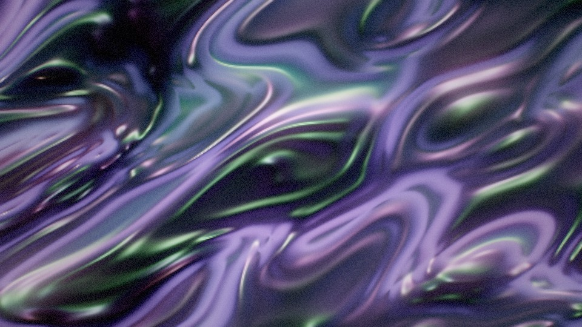 **Silk Aurora** | 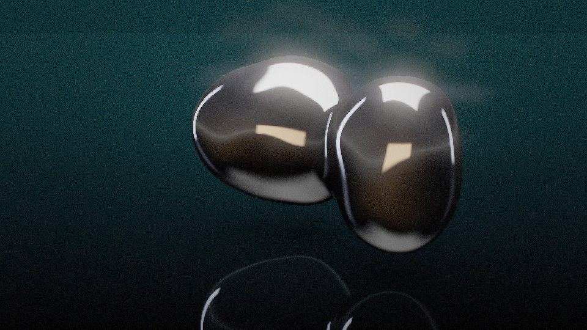 **Liquid Chrome** |
| 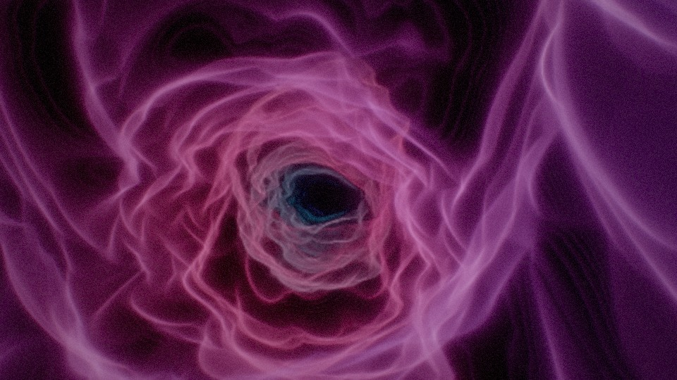 **Astral Fold** (glow or volume renderer) | 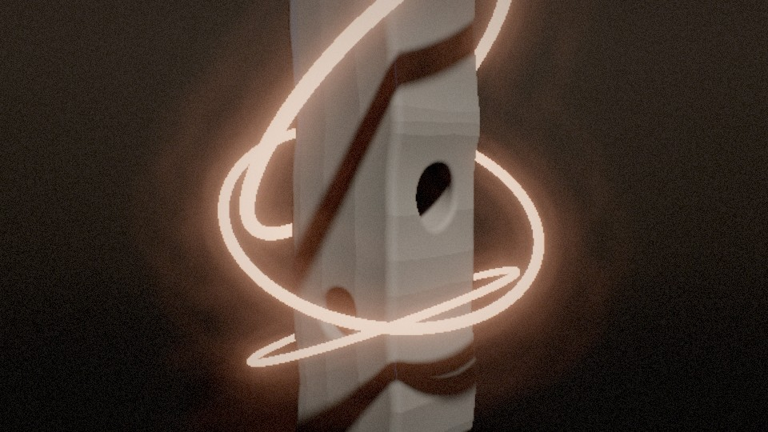 **Monolith** (Lipschitz-bounded march) |
| 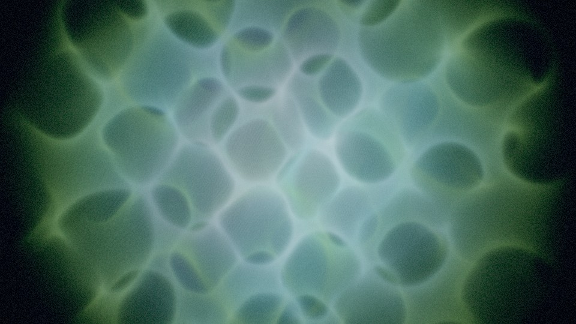 **Cellspace** (gyroid density) | 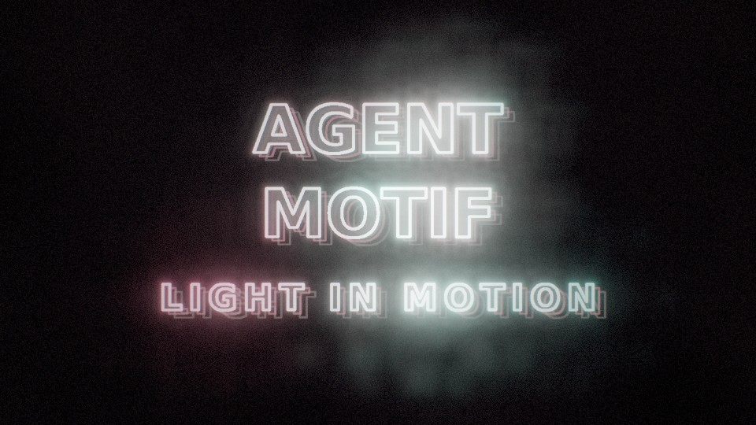 **Lightscript** (editable type, text SDF) |
|  **Caustic Light** | 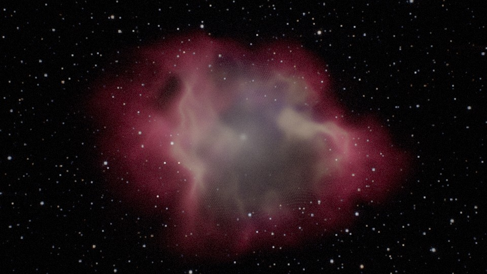 **Nebula Drift** |
| 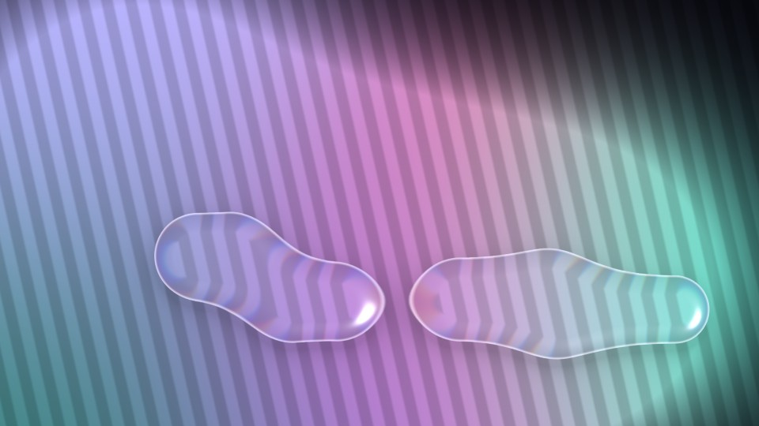 **Liquid Glass** (media) | 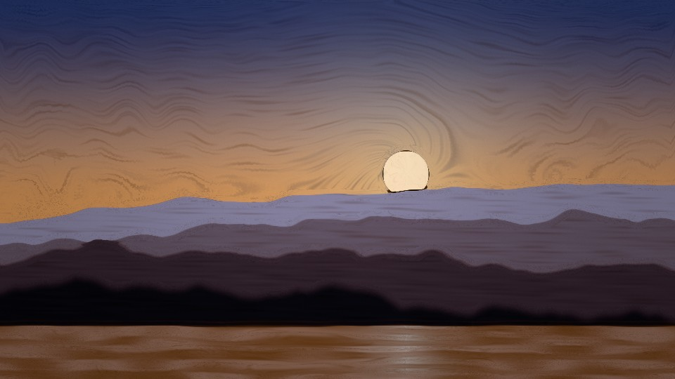 **Painterly** (media) |
| 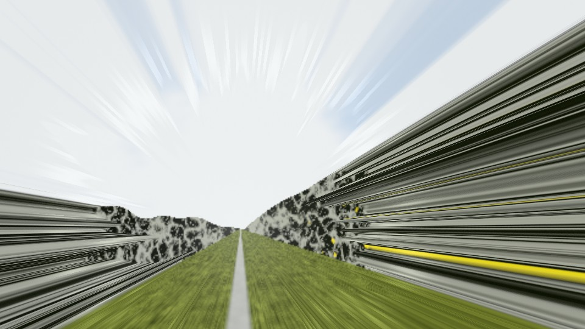 **Light Tunnel** (media, [case study](examples/light-tunnel/README.md)) | 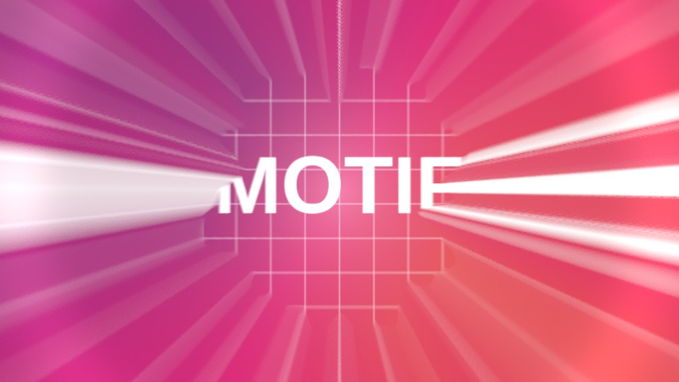 **Tunnel Cut** (transition) |

## What's here

| Path | What |
| --- | --- |
| [`AGENT.md`](AGENT.md) | The agent's operating manual: the SDK contract, toolchain, the brief → ship loop, taste rules, the curiosity protocol and the SDK-proposal protocol. This is the single source of truth. |
| [`lib/glsl/`](lib/glsl) | The AgentMotif GLSL library (32 KB, loop-safe, passes the SDK 4 sandbox): `field` (field taxonomy, Astral cosine fold with its Lipschitz bound, renderers `AM_MARCH_L` / `AM_SEGMENT` / `AM_GLOW` / `AM_VOLUME`), `color` (OKLab/OKLCh, AgX, PBR Neutral, grading), `noise` (curl, domain warp, flow maps, gyroid volumes, caustics, stars, IGN), `light` (GGX, split-sum env, procedural studio HDRI, thin film, spectral, sheen, HG phase), `post` (bloom, halation, anamorphic, spectral CA, bokeh, Kuwahara, CAS, grain), `sdf` (2D/3D primitives, operators, raymarch/normal/shadow/AO macros), `motion` (bezier easing, springs, stagger, on-twos). |
| [`tools/am.mjs`](tools/am.mjs) | The look-dev CLI on the SDK 4 runtime: `analyze`, `compare`, `tune`, `qa` (adds quality-exposure and transition-endpoint checks), `film`, `frame` (styles, effects, transitions, text and media inputs), `lib` (with the app's sandbox analysis), `new` (an @4 graph scaffold). |
| [`tools/metrics.js`](tools/metrics.js) | The perceptual fingerprint and score: OKLab k-means palette, sliced-Wasserstein colour distance, tone stats, power-spectrum slope, structure tensor, radial streak index, symmetry, multi-scale SSIM, and a gap report written as shader moves. |
| [`knowledge/`](knowledge) | [Technique atlas](knowledge/technique-atlas.md) · [Look-dev rules](knowledge/look-dev.md) · [Research radar](knowledge/research-radar.md) · [Rubric](knowledge/rubric.md) · [SDK proposals](knowledge/sdk-proposals.md) |
| [`kits/agent-motif/`](kits/agent-motif) | Showcase kit 2.0 (`motif-kit@4`, capabilities `media` + `text`): 11 styles on 4-pass graphs with a two-level bloom pyramid, the **AgentMotif Lens** effect, the **Tunnel Cut** transition, the **reel** sequence (8 styles over 24 s) and 3 export presets. Packed at `dist/agent-motif-2.0.0.motifkit`. |
| [`examples/light-tunnel/`](examples/light-tunnel/README.md) | Worked case study: a reference frame rebuilt as a shader (score 26.8 → 56.2), including the optimiser trap and how the agent handled it. |

## Use it

**In Claude Code (this repo):** the agent is installed as the subagent `agent-motif` (`.claude/agents/`) and the skill `/agent-motif` (`.claude/skills/`). Ask, for example:

> Use agent-motif: make a shader from `refs/oil-slick.jpg`, a slow, viscous holographic oil film for a fashion title.

**Elsewhere:** `agent-skills/skills/agent-motif/SKILL.md` is the distributable skill (served by `motif-bridge` like the other 16 studio skills). After editing `AGENT.md`, run `node agent-motif/tools/sync-agent.mjs` to regenerate all four entry points.

## Toolchain quickstart

```bash
(cd Motif3/sdk/motif-kit-sdk-4.0.0 && npm i)    # fflate + playwright (Chromium is auto-detected)
AM="node agent-motif/tools/am.mjs"

$AM analyze ref.jpg --out work                  # fingerprint, palette, technique hints, board PNG
$AM new kits/my-kit --id my-kit                 # kit scaffold wired to the library
$AM frame kits/my-kit hero --w 1280 --h 720     # look at it
$AM compare kits/my-kit hero --ref ref.jpg --phase 0.2,0.5,0.8
$AM tune kits/my-kit hero --ref ref.jpg --only scale,glow,exposure --apply
$AM qa kits/my-kit                              # seam, pops, WCAG flash test (Motif audit method), cost, filmstrip
$AM film kits/my-kit hero --seconds 6           # .webm for review
node Motif3/sdk/motif-kit-sdk-4.0.0/bin/motif-kit.mjs validate kits/my-kit   # sandbox budgets per entry
node Motif3/sdk/motif-kit-sdk-4.0.0/bin/motif-kit.mjs pack kits/my-kit --out dist
```

Flags: `--media img` feeds media styles, `--no-media` renders their procedural fallback, `--params p.json` overrides parameters, and `--mode style|layout|exact` sets how much composition and pixel structure count in scoring.

Headless renders use SwiftShader on the CPU. Timings are for comparing versions, not real frame rates (a GPU is 20–100× faster).

## Showcase kit status

- **SDK 4.0 checks:** `motif-kit validate` and `motif-kit preview` pass all 13 entries and the sequence (seam ×0.1).
- **`am qa`:** seams Δ0, no pops, and the flash audit passes everywhere. Liquid Chrome has 2 tiles at 6 flashes/s at worst-case tempo; the audit fails at 4 tiles, so it passes.
- **Quality-exposure ratios (min vs max steps):**

  | Style | Ratio |
  | --- | --- |
  | Nebula | ×0.996 |
  | Monolith | ×0.999 |
  | Cellspace | ×0.991 |
  | Liquid Chrome | ×0.984 |
  | Astral (volume) | ×0.96 |
  | Astral (glow, calibrated) | ×1.02 (×2.43 uncalibrated) |

- **Transition endpoints:** Δ0 at progress 0 and 1.

## What changed for SDK 4 and the Astral research

- The toolchain runs the SDK 4 runtime (graphs, effects, transitions, text atlases, svg and text distance fields, stacks).
- **Correctness pass on the library and kit:**
  - Reversed `smoothstep` edges are reordered for portability.
  - The gyroid shell is now a true bound (÷√6).
  - Liquid Chrome's ripple is Lipschitz-scaled.
  - The twist bound is documented.
  - A loop seam in a camera bob is fixed.
- **New `field` module, styles and entries:**
  - The `field` module adds the research's renderer taxonomy.
  - Four styles come from the research's directions (Astral Fold, Monolith, Cellspace, Lightscript).
  - New entries: the Lens effect, the Tunnel transition, the reel sequence and the exporters.
- **SDK proposals re-checked:**
  - Closed: pass graphs.
  - Partly shipped: audio, effects, svg.
  - Still open: mipmapped / HDR-guaranteed buffers, export motion blur.
  - New: field-class metadata (P-11) and a quality-exposure canary (P-12).

## Decisions for the team

[`knowledge/sdk-proposals.md`](knowledge/sdk-proposals.md) ranks the open SDK extensions after the SDK 4 re-check. The top four:

1. **Export motion blur and supersampling** (host-side, exact because frames are pure functions of `u_p`).
2. **Mipmapped, float-guaranteed graph buffers** plus `u_hdr` (SDK 4 still falls back to RGBA8 silently, clipping HDR bloom).
3. **Field-class metadata** and a **quality-exposure canary**, which turn the research's correctness rules into checks the app runs.
4. **A temporal-state contract** (seed, timestep, reset, warm-up, checkpoints, replay, export policy) before any persistent simulation.
