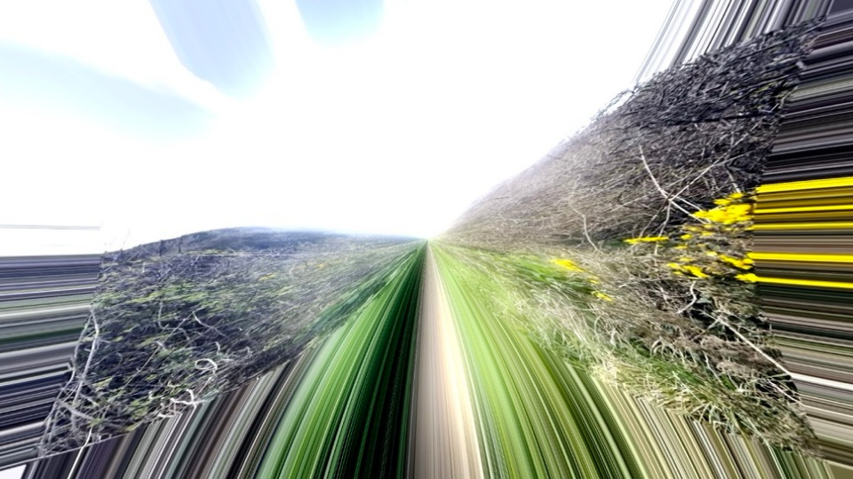
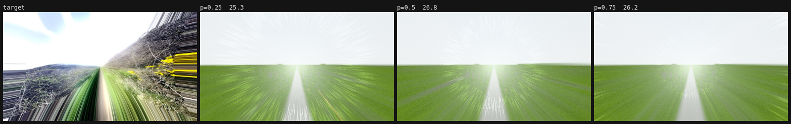
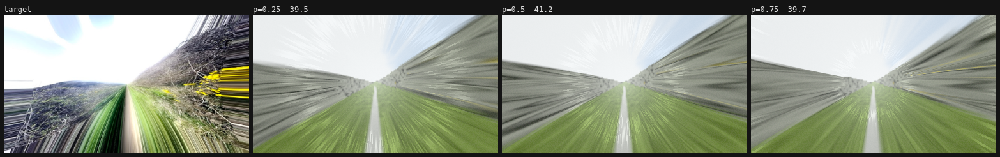
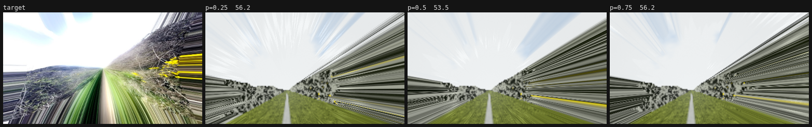

# Case study: Light Tunnel (image → shader)

**Brief.** Rebuild the frame in `references/IMG_3312.jpeg` (DaVinci Resolve's *Tunnel of Light* transition on a hiking clip) as a real-time Motif style. It should work on any attached image, and be a convincing procedural facsimile when no media is attached.

## 1. Read
`am analyze target.jpg` → [`target.brief.json`](target.brief.json), [`target.brief.png`](target.brief.png)

- High-key (mean L 0.72, 36% near-white sky), near-monochrome (chroma 0.029) with an olive/green hue mass at 90–120°.
- β 2.73 (photographic detail), edge density 0.34 (dense twigs), grain 0.056.
- **Radial streak index 0.59.** The first pass of the analyser missed this: global orientation coherence was only 0.25, because radial lines average out. AgentMotif added the radial index to the metrics during this brief. It now flags tunnels, zoom blur and god rays automatically.

Look statement: *a hiking trail shattered into converging speed streaks around a vanishing point: blown-out sky, dry scrub banks (right bank higher and flowered), green ground streaks, a sharp centre.*

## 2. Decompose
| Layer | Technique |
| --- | --- |
| Ground / form | Pass 1 (0.5×): the attached media, or a procedural trail scene built for **angular detail**: ridged-noise twigs, flowers, grass blades and a converging path |
| Signature | Pass 2: polar stretch. Beyond a jagged radius R(θ), sample the subject at R(θ), so colour is constant along each ray and produces streaks |
| Motion | The stretch front breathes once per loop, light pulses rush outward in log-radius (integer count per loop), and a short IGN-jittered zoom blur |
| Lens | Core glow, streak shading, PBR Neutral tone map (keeps the photo's colour), grain |

## 3. Iterate

| Version | Change | Score (style mode, best phase) |
| --- | --- | --- |
| v1 | First build: flat green field source | **26.8** |
| v2 | Source rebuilt with embankments, scrub and flowers | **41.2** |
| v3 | Darker high-contrast scrub, larger sharp centre, olive accent | **48.2** |
| tune 1 | CMA-ES over 11 params. Lifted the score by deleting the streaks (squash → 0.5). **Rejected by eye.** | 53.1 |
| tune 2 | Structure locked (radius, squash); elitist CMA-ES with step-size control added to `am tune` | 57.5 |
| v4 | Tuned defaults applied; angular grass blades | 54.1 |
| final | Tone tune at three phases, `--apply` | **56.2** |

| v1 | v2 | final |
| --- | --- | --- |
|  |  |  |

Tune sheets: [`tune/`](tune/tune-light-tunnel.png) (the rejected optimum), [`tune2/`](tune2/tune-light-tunnel.png).

## 4. What's still off, and why
- **Structure (36) and layout (40)** are capped because the target is a *photo*: real twigs and real clouds. With the hiking clip attached as media, the style applies the same transform to the real pixels, and that is the deliverable for this effect. The procedural fallback is judged on feel.
- The procedural scrub reads as noise up close. Next step: an SDF branch/twig generator (L-system-like recursive segments) in `tunnel-source`.

## 5. What the agent learned (now in the knowledge base)
- **Radial index** added to `metrics.js` (fingerprint, compare, gaps and hints).
- **Optimiser trap**: lock structural parameters and let the eye overrule the number. Recorded in `technique-atlas.md`.
- `am tune` gained elitism and 1/5th-success step-size control. It now converges where the first version stalled at generation 3.

## 6. Alternatives worth trying
1. **Depth-aware tunnel** (needs [P-06](../../knowledge/sdk-proposals.md#p-06-derived-media-inputs-depth-segmentation-flow)): stretch by depth instead of radius, so near objects streak more, as real motion parallax does.
2. **Export motion blur** ([P-07](../../knowledge/sdk-proposals.md#p-07-export-time-motion-blur-and-supersampling)): integrate the rush over a 180° shutter for broadcast smoothness.
