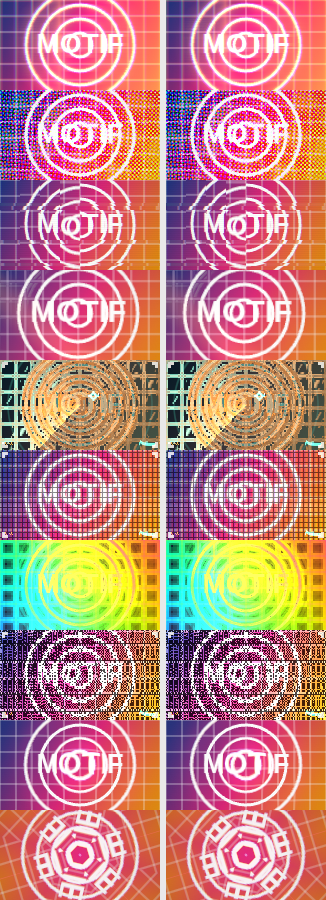

# motif-metal

Converts Motif web kits (`motif-kit@1`, GLSL ES 3.00 for WebGL2) into Metal for **macOS and iPadOS**, and ships the Swift runtime that plays them.

```
motif-metal convert wallcast-1.0.0.motifkit --out metalKits     # kit → Swift package + .metal + .metalkit
motif-metal check   wallcast-1.0.0.motifkit                     # convert, lint, type-check every pass
motif-metal parity  wallcast-1.0.0.motifkit [--sheet out.png]   # render in WebGL and in Metal-on-CPU, compare
motif-metal show    wallcast-1.0.0.motifkit halftone-pulse      # print the generated MSL
```

Input is anything the web SDK reads: a kit folder, a `.motifkit` zip, or a `{ manifest, files }` JSON bundle. No npm install: the tool has no dependencies (Node 18+).

## What you get

```
metalKits/wallcast-metal/
  Package.swift                       Swift package (macOS 12+, iOS/iPadOS 15+), depends on the MotifMetal runtime
  Sources/WallcastMotifKit/           WallcastKit.definition: styles, params, palettes, embedded Metal source
  Metal/<kit>_<style>_p<n>.metal      one self-contained .metal per pass (for inspection or precompiling)
  wallcast-1.0.0.metalkit             the whole kit as one JSON file, loadable at runtime
  kit.json                            styles, params (with buffer slot), palettes, media inputs, for non-Swift hosts
  Tests/                              XCTest: every pass compiles with the real Metal compiler, renders, and loops close
  build-metallib.sh                   optional precompile to .metallib for macOS and iPhoneOS SDKs
```

Use it:

```swift
import MotifMetal
import WallcastMotifKit

// SwiftUI, macOS and iPadOS
MotifView(kit: WallcastKit.definition, styleID: "prism-split",
          params: ["split": 0.03, "spectral": true], loopSeconds: 8)

// or load a kit that was not compiled into the app
let kit = try MotifKitDefinition(contentsOf: url)           // a .metalkit file

// offline / deterministic: same state, same pixels
let renderer = try MotifRenderer()
let image = try renderer.renderImage(kit: kit, style: kit.style("prism-split")!,
                                     state: MotifRenderState(phase: 0.25, seed: 417), width: 1920, height: 1080)

// or encode into your own Metal pipeline
try renderer.encode(kit: kit, style: style, state: state, target: drawable.texture, commandBuffer: cb)
```

`MotifInspector(style:values:)` builds the parameter controls the way the web inspector does (groups, sliders, steppers, toggles, pickers, `show` conditions). `swift/Examples/Playground` is a complete one-file macOS + iPadOS app.

Media inputs work like the web: `renderer.makeMedia(image: cgImage, fit: .fill, frameSize: size)` bakes a still (or `makeMedia(texture:)` a decoded video frame) to the frame's aspect ratio, premultiplied and linear with mipmaps; pass it as `state.media["source"]`.

## How the translation works

The web runtime builds each pass as `PRELUDE + param uniforms + media inputs + kit common + pass source + main()`. `motif-metal` builds the same string with the SDK's own `buildSource` (a copy of `kit-gl.js` lives in `lib/`), swaps the web-only `main()` for a Metal fragment entry point, and translates the result. The prelude, helpers (`ln2`, `lvoro`, `tslot`, the photosensitive limiter, `aces` …) and the final sRGB/dither step are therefore *the web code, translated*, and cannot drift from it. Update `lib/kit-gl.js` when the SDK changes.

Each pass becomes one C++ struct:

```metal
struct MPass_wallcast_halftone_pulse_p1 {
  float2 u_res; float u_p; …          // uniforms are fields
  int p_cells; bool p_hud; …          // so are params
  float4 motif(float2 uv, float2 fc) { … }   // every function is a member: uniforms read as plain identifiers
};
fragment float4 mfs_wallcast_halftone_pulse_p1(float4 pos [[position]], constant MotifUniforms& U, constant float* P, textures…)
```

Macros, structs and program-scope `const` data are hoisted above the struct. Nothing in a kit's GLSL has to be threaded through arguments.

| GLSL | Metal |
| --- | --- |
| `vec3`, `ivec2`, `mat2`, `sampler2D` | `float3`, `int2`, `float2x2`, `MTex` |
| `mat2(a, b, c, d)` | `float2x2(float2(a, b), float2(c, d))` |
| `float a[3]`, `float[3](…)`, array params/assign | `array<float,3>` (assignable, copied by value) |
| `mod`, `min/max/clamp/mix/step/smoothstep` with scalar-for-vector args | `M_mod`, `M_min` … overloads that accept them. They still call `metal::min/max/clamp`, which is what ANGLE emits when WebGL runs on Metal, so NaN behaviour matches the web on the same Apple GPU |
| `atan(y, x)`, `inversesqrt`, `roundEven` | `atan2`, `rsqrt`, `rint` |
| `texture(s, uv)`, `texelFetch` | `M_tex`, `M_texelFetch` (flip v: GL origin is bottom-left, Metal's is top-left) |
| `gl_FragCoord` | `float4(pos.x, height - pos.y, …)` |
| `dFdy(x)` | `M_dFdy(x)` = `-dfdy(x)` (because the line above flips y) |
| `a == b` on vectors | `M_eq(a, b)` (one bool, like GLSL) |
| `out` / `inout` params | `thread T &` |
| `floatBitsToUint` … | overloads over `as_type` |
| names reserved in C++/MSL (`half`, `new`, `kernel` …) | suffixed with `_` |

Output conventions match the web exactly: premultiplied, linear RGBA from `motif()`; the final pass converts to sRGB, dithers and premultiplies (`MotifOutputEncoding.webSRGB`). Targets with an sRGB pixel format get linear output instead, so the hardware encodes (`.automatic`). Intermediate passes are `rgba16Float` at `scale` of the frame; pass *n* sees passes 0…n-1 as `u_buf0…3`. Pass sources compile with fast-math off, like the web build.

## Verification

Run on any OS (this is what `npm test` does):

- **Translator unit tests** (`test/unit.mjs`).
- **`check`**: converts a kit, lints for GLSL leftovers, then compiles every generated pass as C++ with clang against `test/shim/metal_stdlib`, a CPU stand-in for Metal's types and functions (ext-vector types, swizzles, `array`, textures, derivatives). If `xcrun metal` exists it also runs the real Metal compiler on each pass.
- **`parity`**: renders every style with the real WebGL2 runtime in headless Chromium, and again by running the *generated Metal source* on the CPU through the same shim and the Swift runtime's conventions (pass order, half-float intermediates, row-0-on-top textures, y flip, sRGB + dither, media). With and without media. Reports per-style error; most styles match to ±1 of 255.

Last full run, 17 kits (every kit in this repo with Motif-Kits 1.0.1, Neuro, Quantum, Cyberpunk, Wallcast, Infokit, Kinetic Subdivision, Param Lab), 175 styles at 128×72:
- all 21 kit files convert and type-check, 0 warnings;
- 297 style×variant renders compared: 292 within ±1 level on average, 0 failures. The 5 flagged `≈` are `halftone-pulse` (edge noise from `fwidth` on a high-frequency dot screen) and two styles whose shaders depend on undefined behaviour (listed under *Authoring*).



What this does **not** prove: that Apple's compiler accepts every pass, or how it performs. The shim is not Metal. On a Mac, run `swift test` inside a generated package (compiles each pass with the real compiler, renders it, checks the loop seam) and `check` (which then also invokes `xcrun metal`). Treat those two as the sign-off.

Known differences from the web, by design or by hardware:
- GPUs differ in last-bit precision (`sin`, `pow`, derivatives). High-frequency styles (halftones, fine noise) match structurally but not bit-for-bit; the parity report shows pixel error and 6×6-block error separately.
- `smoothstep` with reversed or equal edges is undefined in GLSL and in `metal::smoothstep`. `M_smoothstep` evaluates the formula, which is what web drivers do: a descending ramp for reversed edges, a hard step for equal ones.
- Derivatives (`fwidth`, `dFdx`) follow each GPU's quad scheme.

## Authoring kits that translate cleanly

Everything in `motif-kit@1` that the SDK documents translates. Things to know:

- Prefer `smoothstep(e0, e1, x)` with `e0 < e1`. Reversed or equal edges are undefined in the GLSL spec (the kit 1.0.1 cleanup notes describe the driver-dependent results); the converted shaders pin them to the formula above.
- Hash integer lattice coordinates, not computed floats. `h21(cen)` where `cen = (a + b + c) / 3.0` depends on the last bit of a float, which differs between GPUs (and between WebGL and Metal), so the random values differ. Mosaic's `low-poly` does this; the parity report lists it as a known case.
- Don't let NaN decide a result. `pow(x, y)` with `x < 0` is NaN; `sin(PI)` is -8.7e-8 in float, so `pow(sin(PI * t), 0.75)` is NaN at `t = 1`. What min/max/clamp/smoothstep do with a NaN differs per GPU (and from SwiftShader to Apple's). Mosaic's `sprite-mosaic` banana does this; clamp with `max(x, 0.0)` first.
- Vector `.length()` and `uniform` arrays are not supported (the tool warns). Array `.length()` becomes `.size()`.
- Unsized arrays (`float a[] = …`) need an explicit size.
- Keep array parameters small and by value; Metal copies them.
- `a == b` rewriting is name-based (identifiers declared with a vector type, or swizzles of two or more components). Comparing two function-call results of vector type should use `all(a == b)`.

## Layout

```
bin/motif-metal.mjs         CLI
lib/kitio.mjs               folder / .motifkit / JSON reader (own zip reader, no dependencies)
lib/kit-gl.js               copy of the web SDK runtime: validation, prelude, buildSource
lib/translate.mjs           GLSL → MSL
lib/msl-header.mjs          Metal compat layer + fragment entry point
lib/convert.mjs             kit → package
swift/MotifMetal/           runtime: MotifKitDefinition, MotifRenderer, MotifView + MotifInspector (SwiftUI), media baking, tests
swift/Examples/Playground/  one-file SwiftUI app for macOS and iPadOS
test/                       unit tests, clang shim, check, parity
```
